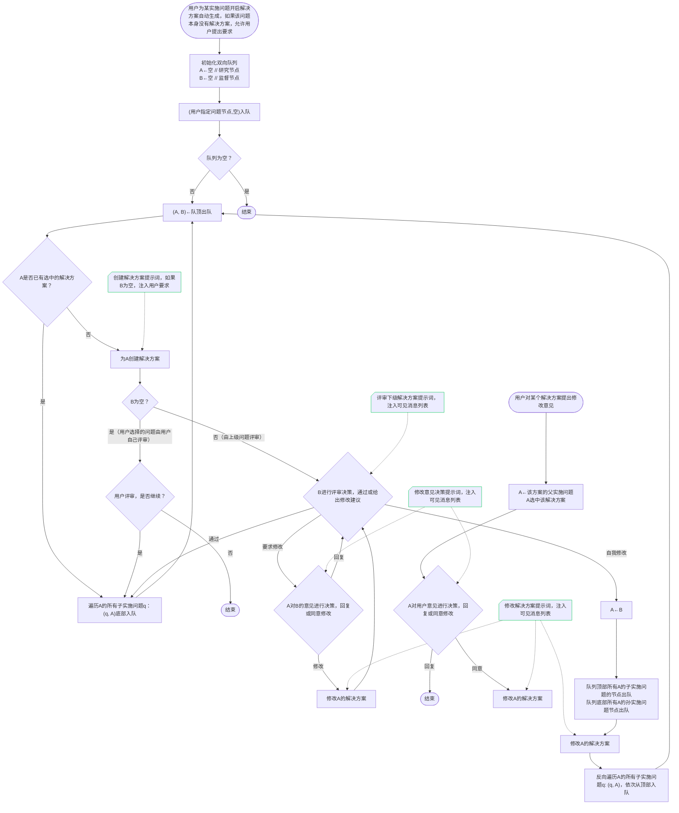

# ResVizCopilot 2.0 - 科研智能体项目

## 项目概述

ResVizCopilot 2.0 是一个基于大模型的科研智能体项目，旨在帮助研究人员管理研究问题和解决方案。项目采用前后端分离架构，通过智能体协程和流式传输技术提供流畅的用户体验。

### 核心特性

- **研究树数据管理**：支持问题-解决方案的层级结构管理
- **智能体流式交互**：基于SSE的实时流式对话
- **快照版本控制**：完整的数据历史可追溯性
- **工程级别管理**：支持多项目的保存、加载和切换
- **断连重连支持**：智能体协程独立运行，支持前端断连重连
- **指数回退重试**：内置可靠的错误恢复机制

### 技术架构亮点

- **前后端分离**：Vue.js前端 + FastAPI后端
- **智能体协程**：独立于传输层，确保系统稳定性
- **消息管道解耦**：通过异步队列实现智能体与SSE传输的解耦
- **快照不可变性**：所有数据修改都通过快照机制记录
- **XML结构化输出**：标准化的智能体输出格式

## 技术栈

### 后端技术栈
- **Python 3.9+** - 主要开发语言
- **FastAPI** - 高性能异步Web框架
- **Pydantic** - 数据验证和序列化
- **SSE-Starlette** - 服务器发送事件支持
- **Asyncio** - 异步编程支持
- **OpenAI SDK** - DeepSeek API集成

### 核心依赖
```
fastapi==0.104.1
uvicorn[standard]==0.24.0
pydantic==2.5.0
sse-starlette==1.6.5
httpx==0.25.0
openai>=1.0.0
```

### 大模型集成
- **DeepSeek API** - 主要推理引擎
- **模型选择策略**：
  - 复杂任务使用`deepseek-reasoner`：提供更强的推理能力
  - 一般任务使用`deepseek-chat`：提供更快的响应速度

## 项目结构

```
ResVizCopilot-2.0.0/
├── backend/                                  # 后端应用
│   ├── main.py                              # FastAPI应用入口
│   ├── config.py                            # 配置管理
│   ├── project_manager.py                   # 项目管理器（工程保存/加载）
│   ├── routers/                             # API路由模块
│   │   ├── research_tree.py                # 研究树数据操作接口
│   │   ├── agents.py                       # 智能体调用接口
│   │   └── projects.py                     # 工程管理接口
│   ├── database/                            # 数据库管理
│   │   ├── database_manager.py             # 数据库管理器
│   │   └── schemas/                        # 数据模型定义
│   ├── message/                             # 消息管理
│   │   ├── message_manager.py              # 消息管理器
│   │   └── schemas/                        # 消息模型定义
│   ├── agents/                              # 智能体实现
│   │   ├── agent_base.py                   # 智能体基类
│   │   ├── auto_research_agent.py          # 自动研究智能体
│   │   ├── user_chat_agent.py              # 用户对话智能体
│   │   ├── llm_client.py                   # LLM客户端
│   │   ├── retry_wrapper.py                # 重试机制
│   │   └── prompts_and_validators/         # 提示词和验证器
│   ├── utils/                               # 工具模块
│   ├── data/                                # 数据存储
│   │   └── projects/                       # 工程文件存储
│   └── requirements.txt                     # 依赖列表
├── frontend/                                # 前端应用（待实现）
├── test_CLI_frontend.py                     # 命令行测试前端
└── README.md                               # 项目文档
```

## API接口设计

### 研究树数据操作接口

研究树是项目的核心数据结构，支持问题-解决方案的层级管理。所有修改操作都通过快照机制记录，确保数据历史可追溯性。

#### 基础CRUD操作

| 接口 | 方法 | 路径 | 功能描述 |
|------|------|------|----------|
| 创建根问题 | POST | `/research-tree/problems/root` | 创建新的根级研究问题 |
| 更新根问题 | PATCH | `/research-tree/problems/root/{problem_id}` | 更新根问题的标题、意义、标准等 |
| 删除根问题 | DELETE | `/research-tree/problems/root/{problem_id}` | 删除指定的根问题 |
| 创建解决方案 | POST | `/research-tree/problems/{problem_id}/solutions` | 为问题创建解决方案 |
| 更新解决方案 | PATCH | `/research-tree/solutions/{solution_id}` | 更新解决方案内容 |
| 删除解决方案 | DELETE | `/research-tree/solutions/{solution_id}` | 删除解决方案及其子树 |
| 设置选中方案 | POST | `/research-tree/problems/{problem_id}/selected-solution` | 设置问题的当前选中解决方案 |
| 获取快照 | GET | `/research-tree/snapshots/{snapshot_id}` | 获取指定快照的完整数据 |

### 智能体调用接口

智能体接口支持SSE流式传输，实现智能体协程与传输层的完全解耦。

#### 核心接口

| 接口 | 方法 | 路径 | 功能描述 |
|------|------|------|----------|
| 发送消息 | POST | `/agents/messages` | 发送用户消息，启动智能体协程（SSE流式响应） |
| 继续消息 | GET | `/agents/messages/continue/{message_id}` | 继续未完成的消息传输（SSE流式响应） |
| 停止生成 | POST | `/agents/messages/stop` | 中断当前智能体任务 |
| 智能体状态 | GET | `/agents/status` | 获取智能体运行状态 |

#### 已实现的智能体

1. **自动研究智能体** (`auto_research_agent`)
   - 功能：为指定实施问题自动生成解决方案
   - 参数：`problem_id`（目标问题ID）、`content`（用户要求）

2. **用户对话智能体** (`user_chat_agent`)
   - 功能：与指定解决方案进行对话交流
   - 参数：`solution_id`（目标解决方案ID）、`content`（对话内容）

### 工程管理接口

工程管理提供项目级别的持久化功能，支持多项目管理和状态恢复。

#### 工程操作

| 接口 | 方法 | 路径 | 功能描述 |
|------|------|------|----------|
| 创建工程 | POST | `/projects` | 创建新的研究工程 |
| 保存工程 | POST | `/projects/save` | 保存当前工程状态 |
| 另存为工程 | POST | `/projects/save-as` | 将当前工程另存为新名称 |
| 加载工程 | GET | `/projects/{project_name}` | 加载指定工程 |
| 获取工程列表 | GET | `/projects` | 获取所有已保存的工程 |
| 删除工程 | DELETE | `/projects/{project_name}` | 删除指定工程 |
| 当前工程信息 | GET | `/projects/current/info` | 获取当前工程基本信息 |
| 完整工程数据 | GET | `/projects/current/full-data` | 获取当前工程的完整数据 |

## 核心架构设计

### 智能体协程架构

**设计理念**：智能体协程完全独立于SSE传输，通过消息管道实现解耦，确保前端断连不影响智能体执行。


### 数据库架构

**设计理念**：基于快照的不可变数据架构，所有修改都创建新快照，确保完整的历史可追溯性。

#### 核心数据模型


#### 快照管理特性

1. **不可变性**：历史快照完全不可修改
2. **节点复用**：支持通过ID引用已有问题节点
3. **类型约束**：条件问题不能有解决方案，根问题必须为实施类型
4. **树状验证**：确保问题-解决方案交错的树形结构

### 消息流式传输架构

**设计理念**：通过消息管道实现智能体与传输层的完全解耦，支持断连重连和多订阅者模式。

#### 核心组件

1. **MessageManager**：统一消息操作接口，维护消息队列和事件发布
2. **消息管道**：基于`asyncio.Queue`的异步消息队列
3. **Patch机制**：增量更新模式，支持思考、内容、快照等不同类型的更新
4. **订阅者模式**：支持多个SSE连接同时监听消息更新

#### 消息状态管理

- **generating**：消息正在生成中
- **completed**：消息生成完成
- **failed**：消息生成失败

### 重试机制

**设计理念**：针对大模型API的不稳定性，实现指数回退重试机制。

#### 重试策略

- **基础延迟**：1秒
- **最大延迟**：60秒
- **回退因子**：2
- **最大重试次数**：3次
- **可重试异常**：网络错误、API临时故障、超时等

## 智能体业务流程设计

### 智能体调用生成器的模板范式

**设计思路**：将智能体调用封装为回调函数，使用错误重试函数管理，实现统一的错误处理和重试机制。


### 智能体协作逻辑（原设计，暂未完全实现）

**设计思路**：实现复杂的智能体协作逻辑，支持多级问题的自动生成和评审。



## 配置和部署

### 环境变量配置

项目使用环境变量管理配置，支持`.env`文件：

```bash
# DeepSeek API配置
DEEPSEEK_API_KEY=your_api_key_here
DEEPSEEK_BASE_URL=https://api.deepseek.com/v1

# 代理配置（可选）
HTTP_PROXY=http://proxy.example.com:8080
HTTPS_PROXY=http://proxy.example.com:8080

# 模型配置
DEEPSEEK_REASONER_MODEL=deepseek-reasoner
DEEPSEEK_V3_MODEL=deepseek-chat

# 服务配置
BACKEND_HOST=0.0.0.0
BACKEND_PORT=8008

# 日志配置
LOG_LEVEL=INFO

# LLM配置
DEFAULT_MAX_TOKENS=4000
DEFAULT_TEMPERATURE=0.7
```

### 快速启动

1. **安装依赖**
```bash
cd backend
pip install -r requirements.txt
```

2. **配置环境变量**
```bash
# 创建.env文件或设置环境变量
export DEEPSEEK_API_KEY="your_api_key_here"
```

3. **启动服务**
```bash
# 开发模式
uvicorn backend.main:app --host 127.0.0.1 --port 8008 --reload

# 生产模式
uvicorn backend.main:app --host 0.0.0.0 --port 8008
```

4. **验证服务**
```bash
# 访问API文档
curl http://127.0.0.1:8008/docs

# 健康检查
curl http://127.0.0.1:8008/healthz
```

### 测试和验证

项目提供命令行测试前端，可以验证所有功能：

```bash
python test_CLI_frontend.py
```

测试前端支持的功能：
- 创建根问题
- 调用智能体（自动研究、用户对话）
- 工程管理（创建、保存、加载）
- 快照查看和历史回溯

## 开发指南

### 添加新智能体

1. **继承AgentBase类**
```python
from backend.agents.agent_base import AgentBase

class NewAgent(AgentBase):
    async def process_user_message(self, content: str, title: str, other_params: dict = None):
        # 实现智能体逻辑
        pass
```

2. **注册智能体**
```python
# 在routers/agents.py中注册
new_agent = NewAgent(name="new_agent", ...)
shared_message_manager.register_agent("new_agent", new_agent)
```

### 扩展数据模型

1. **定义Pydantic模型**
```python
# 在database/schemas/下添加新模型
class NewNodeType(BaseModel):
    field1: str
    field2: Optional[int] = None
```

2. **更新数据库管理器**
```python
# 在database_manager.py中添加对应操作
async def create_new_node(self, data: NewNodeType) -> Snapshot:
    # 实现创建逻辑
    pass
```

### 扩展API接口

1. **添加路由**
```python
# 在routers/下创建新路由文件
@router.post("/new-endpoint")
async def new_endpoint(request: RequestModel):
    # 实现接口逻辑
    pass
```

2. **注册路由**
```python
# 在main.py中注册
app.include_router(new_router, prefix="/api")
```

## 项目状态

### 已实现功能

- ✅ 完整的研究树数据管理（CRUD操作）
- ✅ 快照版本控制系统
- ✅ 智能体基础框架和协程架构
- ✅ 自动研究智能体（基础功能）
- ✅ 用户对话智能体（基础功能）
- ✅ SSE流式传输系统
- ✅ 断连重连支持
- ✅ 工程级别的保存/加载管理
- ✅ 指数回退重试机制
- ✅ XML输出解析和验证
- ✅ 完整的API接口
- ✅ 命令行测试前端

### 待实现功能

- ⏳ 复杂智能体协作逻辑（如自动评审、多级生成）
- ⏳ 更丰富的提示词模板
- ⏳ 前端Vue.js界面
- ⏳ 用户权限管理
- ⏳ 数据导入导出功能
- ⏳ 更多数据可视化组件

### 技术债务

- 需要完善错误处理和用户反馈机制
- 需要添加更多单元测试和集成测试
- 需要优化性能和内存使用
- 需要完善文档和开发指南

## 总结

ResVizCopilot 2.0 是一个设计精良、技术先进的科研智能体项目。项目在架构设计上采用了多项先进理念：

1. **智能体协程独立性**：确保系统的健壮性和用户体验
2. **快照不可变性**：提供完整的数据历史可追溯性
3. **消息管道解耦**：实现灵活的流式传输架构
4. **工程级别管理**：支持专业的项目管理需求

目前项目的后端架构已经基本完善，具备了完整的数据管理、智能体调用、流式传输等核心功能。接下来的开发重点将是前端界面实现和更复杂的智能体业务逻辑。

项目展现了现代化软件架构的最佳实践，为科研辅助工具的发展提供了有价值的参考。
