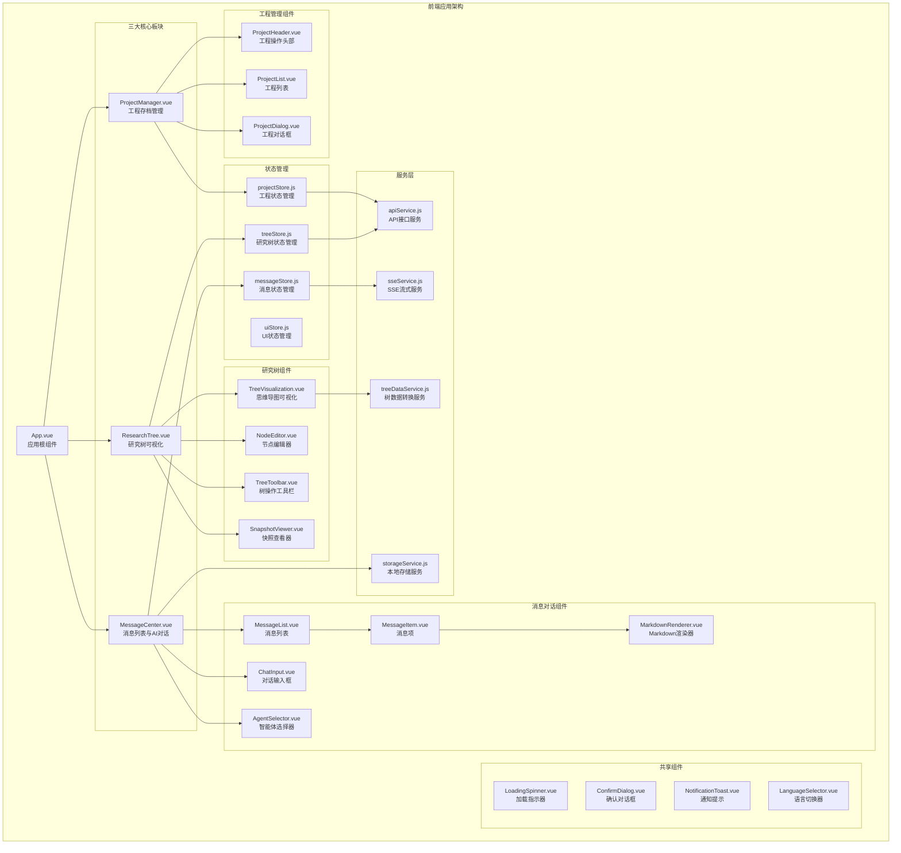
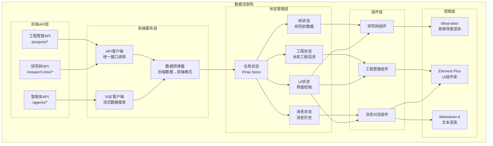
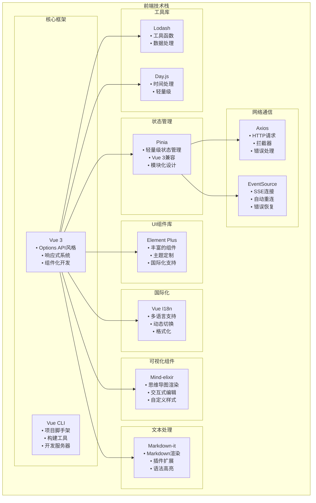
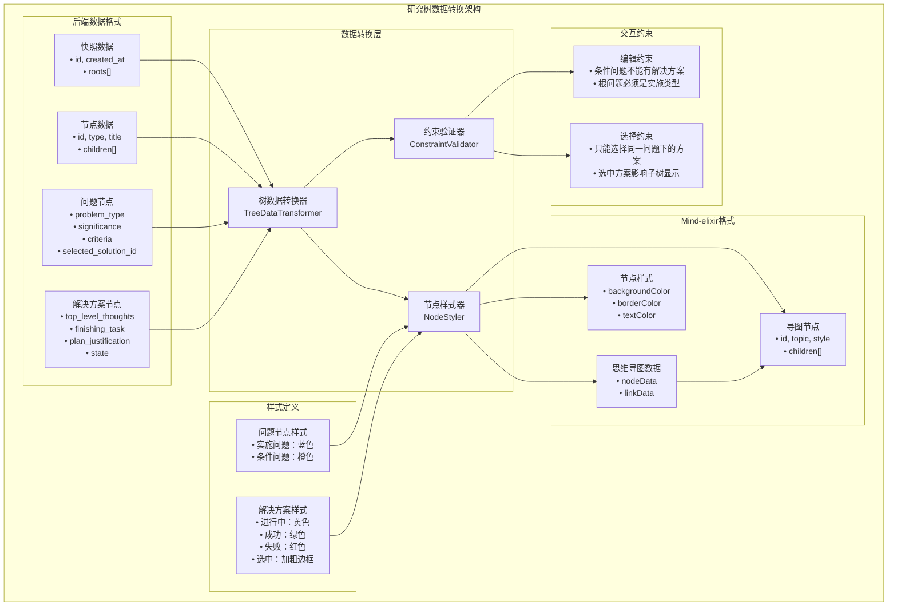
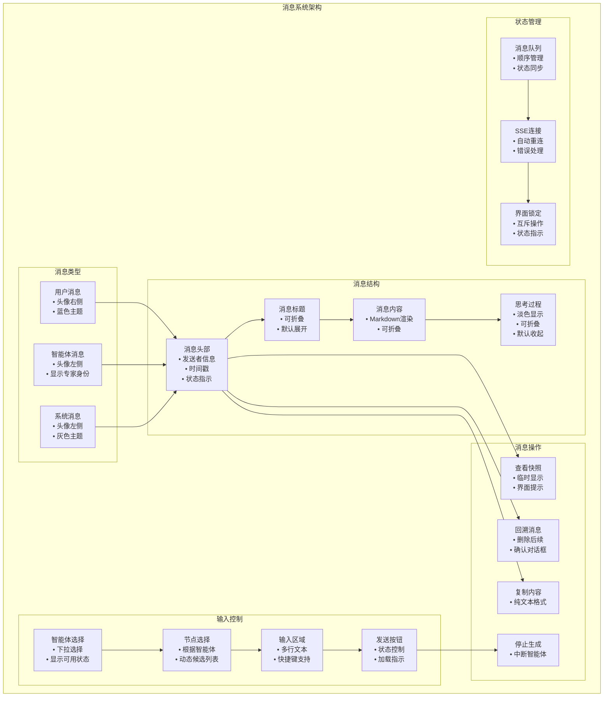
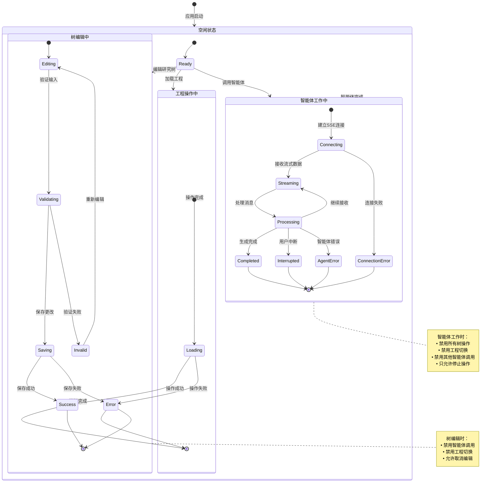
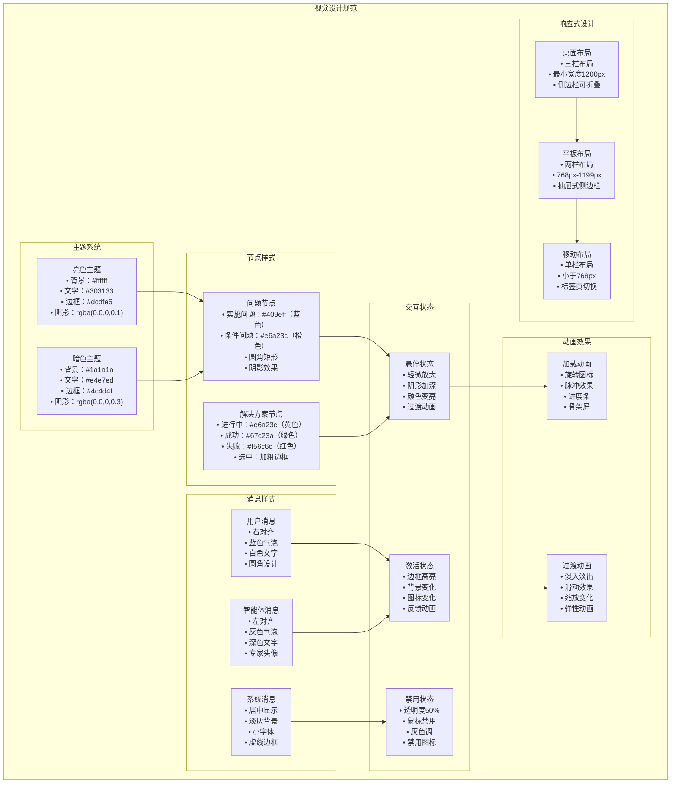
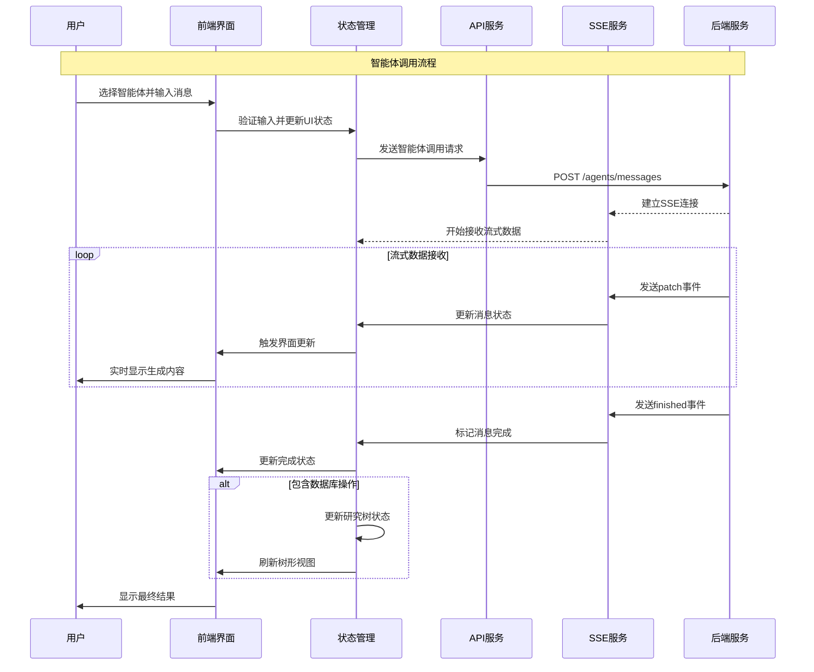
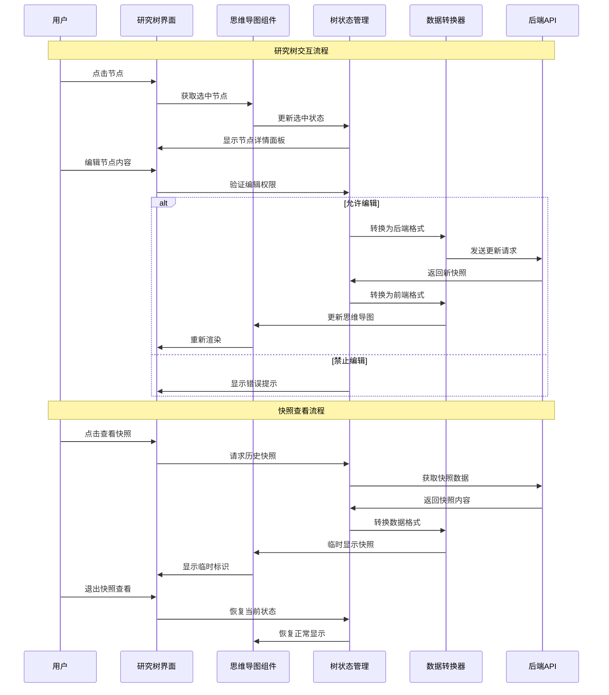

# ResVizCopilot 2.0 前端总体需求和架构设计

## 参考文件说明

本设计文档基于以下参考文件和资源进行设计：

### 需求和规划文件
- **`frontend/前端设计草稿.md`**：用户提供的前端需求草稿，明确了三大功能模块（工程存档管理、研究树可视化、消息列表和AI对话）的基本需求和约束条件
- **`README.md`**：项目整体介绍文档，提供了系统架构、核心功能、技术栈选择和API接口设计的总体框架
- **`openaiapi.json`**：后端接口数据详细说明

### 后端参考
- **`backend/` 目录**：后端实现代码，特别是数据模型定义和API接口实现，为前端数据结构设计和接口对接提供依据
- **`backend/data/projects/测试1.json`**：实际的研究树数据示例，展示了后端数据的完整结构，包括问题节点、解决方案节点的层次关系和属性定义
- **`test_CLI_frontend.py`**：命令行前端测试程序，展示了前端业务逻辑的完整实现，包括消息处理、工程管理、智能体交互等核心功能流程

### 老项目参考
- **`tests/frontend（老）/src/App/MindTree.vue`**：老版本的思维导图组件实现，展示了Mind-elixir的集成方式、节点样式控制、事件处理和数据同步机制
- **`tests/frontend（老）/src/App/ChatBox.vue`**：老版本的聊天组件，提供了消息列表展示、用户交互和UI设计的参考
- **`tests/frontend（老）/src/App/` 其他组件**：包括AppHeader.vue、ProblemInfo.vue、ChatInput.vue、ChatMessage.vue、MarkdownRenderer.vue等，为新版本组件设计提供UI和交互模式参考

### Mind-elixir技术参考
- **`frontend/mind-elixir介绍文档.md`**：Mind-elixir官方文档，详细介绍了思维导图库的功能特性、API接口、配置选项和使用方法
- **`tests/node-menu（mind-elixir的插件，用于参考）/`**：Mind-elixir官方插件示例，展示了如何扩展思维导图功能、自定义节点样式和实现插件机制
- **`tests/frontend（老）/node_modules/mind-elixir/dist/types/index.d.ts`**：Mind-elixir的类型定义文件，提供了完整的API接口说明和数据结构定义

### 参考价值总结
- **需求明确**：通过设计草稿和README明确功能边界和技术要求
- **数据结构清晰**：通过后端代码和测试数据了解完整的数据模型
- **实现路径可行**：通过老项目代码验证技术方案的可行性
- **技术选型合理**：通过Mind-elixir文档和插件示例确保技术实现的最佳实践

## 项目概述

ResVizCopilot 2.0 是一个基于大模型的科研智能体项目，前端采用 Vue 3 + Element Plus 技术栈，实现研究树可视化管理、智能体流式对话和工程存档管理三大核心功能。

### 核心特性

- **研究树可视化**：基于 Mind-elixir 的交互式思维导图，支持问题-解决方案层级结构
- **智能体流式对话**：基于 SSE 的实时流式交互，支持多智能体协作
- **工程存档管理**：完整的项目生命周期管理，支持版本控制和历史回溯
- **响应式设计**：支持桌面、平板、移动端的自适应布局
- **国际化支持**：中英文双语切换，可扩展多语言

## 技术架构

### 前端应用架构图



### 数据流架构图



### 前端技术栈架构图



### 技术栈选择

| 技术 | 版本 | 用途 |
|------|------|------|
| Vue 3 | ^3.3.0 | 核心框架，使用 Options API 风格 |
| Vue CLI | ^5.0.0 | 构建工具，项目脚手架和开发服务器 |
| Pinia | ^2.1.0 | 状态管理，替代 Vuex |
| Element Plus | ^2.3.0 | UI 组件库，丰富的组件生态 |
| Mind-elixir | ^1.0.0 | 思维导图可视化引擎 |
| Markdown-it | ^13.0.0 | Markdown 渲染引擎 |
| Axios | ^1.5.0 | HTTP 客户端 |
| Vue I18n | ^9.4.0 | 国际化解决方案 |


### 整体架构设计

前端采用分层架构设计，从下到上分为：

1. **服务层（Service Layer）**：负责与后端 API 通信和数据处理
2. **状态管理层（State Management）**：使用 Pinia 管理全局状态
3. **组件层（Component Layer）**：可复用的 Vue 组件
4. **视图层（View Layer）**：页面级组件和路由管理

## 功能模块设计

### 1. 工程存档管理模块

#### 功能需求
- 工程的创建、保存、加载、删除
- 工程列表展示和搜索过滤
- 工程信息展示（名称、创建时间、更新时间、快照数量）
- 另存为功能，支持工程复制

#### 组件设计
```
ProjectManager.vue (主组件)
├── ProjectHeader.vue (工程操作头部)
├── ProjectList.vue (工程列表)
├── ProjectDialog.vue (工程对话框)
└── ProjectInfo.vue (工程信息展示)
```

#### 状态管理
```javascript
// projectStore.js
export const useProjectStore = defineStore('project', {
  state: () => ({
    currentProject: null,      // 当前工程信息
    projectList: [],          // 工程列表
    isLoading: false,         // 加载状态
    lastSaveTime: null        // 最后保存时间
  }),
  
  actions: {
    async createProject(name),
    async saveProject(),
    async loadProject(name),
    async deleteProject(name),
    async fetchProjectList()
  }
})
```

#### API 接口对接

⚠️ **重要**：以下接口说明基于后端实际代码，与原设计有差异

**工程管理接口**
- `POST /projects?project_name={name}` - 创建工程（使用query参数，非body）
- `GET /projects` - 获取工程列表
- `GET /projects/{project_name}` - 加载工程
- `POST /projects/save` - 保存当前工程
- `POST /projects/save-as?new_project_name={name}` - 另存为工程（使用query参数）
- `DELETE /projects/{project_name}` - 删除工程

**数据结构映射**
```javascript
// 后端返回格式
{
  success: true,
  projects: [
    {
      project_name: "测试1",  // 注意：字段名是project_name
      created_at: "2025-08-29T12:29:39.253808",
      updated_at: "2025-08-31T09:45:57.599869",
      file_path: "..."
    }
  ]
}

// 前端转换后格式
{
  name: "测试1",           // 转换为name字段
  created_at: "...",
  updated_at: "...",
  file_path: "..."
}
```

### 2. 研究树可视化模块

#### 功能需求

**✅ 当前阶段实现功能：**
- 基于 Mind-elixir 的思维导图渲染
- 支持问题节点（实施问题、条件问题）和解决方案节点的正确显示
- 节点样式区分：多层次可扩展的节点样式系统（基础类型、状态、高亮等）
- 快照查看：临时显示历史快照状态
- 选中方案管理：可视化显示当前选中的解决方案
- 节点信息展示：显示节点详细信息（只读模式）

**🚧 暂不实现功能（留待后续版本）：**
- ❌ 交互式编辑：节点的创建、编辑、删除
- ❌ 约束验证：编辑权限和业务规则检查
- ❌ 拖拽操作：节点位置调整和层级变更
- ❌ 右键菜单：节点操作菜单
- ❌ 实时编辑同步：多用户协同编辑

#### 组件设计
```
ResearchTree.vue (主组件) ✅
├── MindElixirWrapper.vue (Mind-elixir包装器) ✅
├── NodeInfoPanel.vue (节点信息面板) ✅
├── SnapshotControls.vue (快照控制器) ✅
└── services/
    ├── ResearchTreeTransformer.js (数据转换服务) ✅
    └── MindElixirConfig.js (Mind-elixir配置) ✅
```

##### 核心组件实现
```vue
<!-- MindElixirWrapper.vue - Mind-elixir包装器 -->
<template>
  <div class="mind-elixir-container">
    <div ref="mindElixirEl" class="mind-elixir-canvas"></div>
    <div v-if="isSnapshotView" class="snapshot-indicator">
      📸 正在查看历史快照
      <el-button size="small" @click="exitSnapshotView">返回当前</el-button>
    </div>
  </div>
</template>

<script>
import MindElixir from 'mind-elixir'
import { ResearchTreeTransformer } from '@/services/ResearchTreeTransformer'
import { MindElixirConfig } from '@/services/MindElixirConfig'

export default {
  name: 'MindElixirWrapper',
  props: {
    snapshotData: Object,
    isSnapshotView: Boolean,
    agentOperatingNodeId: String
  },
  emits: ['node-selected', 'exit-snapshot-view'],
  
  data() {
    return {
      mindElixir: null,
      transformer: new ResearchTreeTransformer()
    }
  },
  
  mounted() {
    this.initMindElixir()
  },
  
  beforeUnmount() {
    if (this.mindElixir) {
      this.mindElixir.destroy()
    }
  },
  
  watch: {
    snapshotData: {
      handler(newData) {
        if (newData && this.mindElixir) {
          this.updateMindMap(newData)
        }
      },
      deep: true
    },
    
    agentOperatingNodeId(newNodeId) {
      // 更新智能体操作状态
      this.updateAgentOperatingNode(newNodeId)
    }
  },
  
  methods: {
    initMindElixir() {
      const config = MindElixirConfig.getReadOnlyConfig({
        el: this.$refs.mindElixirEl,
        onNodeSelect: this.handleNodeSelect
      })
      
      this.mindElixir = new MindElixir(config)
      
      if (this.snapshotData) {
        this.updateMindMap(this.snapshotData)
      }
    },
    
    updateMindMap(snapshotData) {
      const context = {
        isSnapshotView: this.isSnapshotView,
        agentOperatingNodeId: this.agentOperatingNodeId
      }
      
      const mindElixirData = this.transformer.transformToMindElixir(snapshotData, context)
      
      if (mindElixirData.theme) {
        this.mindElixir.changeTheme(mindElixirData.theme)
      }
      
      this.mindElixir.refresh(mindElixirData)
    },
    
    handleNodeSelect(nodeObj) {
      this.$emit('node-selected', {
        id: nodeObj.id,
        title: nodeObj.topic,
        data: nodeObj
      })
    },
    
    updateAgentOperatingNode(nodeId) {
      // 通过重新渲染更新智能体操作状态
      if (this.snapshotData) {
        this.updateMindMap(this.snapshotData)
      }
    },
    
    exitSnapshotView() {
      this.$emit('exit-snapshot-view')
    }
  }
}
</script>
```

##### Mind-elixir配置服务
```javascript
// MindElixirConfig.js - Mind-elixir配置管理
export class MindElixirConfig {
  // 获取只读模式配置
  static getReadOnlyConfig(options = {}) {
    return {
      el: options.el,
      direction: MindElixir.SIDE,
      locale: 'zh_CN',
      
      // 禁用所有编辑功能
      draggable: false,
      editable: false,
      contextMenu: false,
      toolBar: false,
      keypress: false,
      
      // 禁用所有编辑操作
      before: {
        insertSibling: () => false,
        insertParent: () => false,
        addChild: () => false,
        removeNode: () => false,
        removeNodes: () => false,
        moveNode: () => false,
        moveUpNode: () => false,
        moveDownNode: () => false,
        moveNodeIn: () => false,
        moveNodeBefore: () => false,
        moveNodeAfter: () => false,
        copyNode: () => false,
        copyNodes: () => false,
        beginEdit: () => false
      },
      
      // 自定义事件处理
      ...this.getEventHandlers(options)
    }
  }
  
  // 获取事件处理器
  static getEventHandlers(options) {
    const handlers = {}
    
    // 节点选择事件
    if (options.onNodeSelect) {
      handlers.onNodeSelect = options.onNodeSelect
    }
    
    return handlers
  }
  
  // 获取主题配置
  static getTheme(themeName = 'default') {
    const themes = {
      default: {
        name: 'Default',
        palette: ['#848FA0', '#748BE9', '#D2F9FE', '#4145A5', '#789AFA'],
        cssVar: {
          '--main-color': '#444446',
          '--main-bgcolor': '#ffffff',
          '--color': '#777777',
          '--bgcolor': '#f6f6f6'
        }
      },
      snapshot: {
        name: 'Snapshot',
        palette: ['#bdc3c7', '#95a5a6', '#7f8c8d', '#34495e', '#2c3e50'],
        cssVar: {
          '--main-color': '#666666',
          '--main-bgcolor': '#f5f5f5',
          '--color': '#999999',
          '--bgcolor': '#fafafa'
        }
      }
    }
    
    return themes[themeName] || themes.default
  }
}
```

#### 研究树数据转换架构图



#### 数据转换设计

**后端数据格式 → Mind-elixir 格式转换**

```javascript
// 后端快照数据结构
{
  id: "snapshot_id",
  created_at: "2024-01-01T00:00:00Z",
  roots: [
    {
      id: "node_id",
      type: "problem",
      title: "研究问题标题",
      problem_type: "implementation", // 或 "conditional"
      selected_solution_id: "solution_id",
      children: [...]
    }
  ]
}

// 转换为 Mind-elixir 格式
{
  nodeData: {
    id: "root",
    topic: "研究树",
    children: [
      {
        id: "node_id",
        topic: "研究问题标题",
        style: {
          backgroundColor: "#409eff", // 实施问题蓝色
          borderColor: "#409eff",
          color: "#ffffff"
        },
        children: [...]
      }
    ]
  }
}
```

#### 节点样式设计（基于Mind-elixir原生属性）

基于Mind-elixir的原生样式系统，使用`style`、`tags`、`icons`属性实现节点的视觉区分：

##### 节点类型样式映射
```javascript
// 节点样式配置 - 使用Mind-elixir原生属性
const NodeStyleConfig = {
  // 基础节点类型样式
  nodeTypes: {
    implementation_problem: {
      style: {
        background: '#e6f7ff',
        color: '#1890ff'
      },
      tags: ['实施问题']
    },
    conditional_problem: {
      style: {
        background: '#fff1f0',
        color: '#ff4d4f'
      },
      tags: ['条件问题']
    },
    solution: {
      style: {
        background: '#f9f0ff',
        color: '#722ed1'
      },
      tags: ['解决方案']
    }
  },
  
  // 状态指示器（使用图标）
  statusIcons: {
    pending: '',           // 无图标
    in_progress: '🔄',     // 进行中
    completed: '✅',       // 已完成
    failed: '❌'           // 失败
  },
  
  // 特殊状态标识
  specialMarkers: {
    selected_solution: '⭐',    // 选中的解决方案
    agent_operating: '🤖',     // 智能体正在操作
    snapshot_view: '📸'        // 快照查看状态
  }
}
```

##### 数据转换器实现
```javascript
// 研究树数据转换器
class ResearchTreeTransformer {
  constructor() {
    this.styleConfig = NodeStyleConfig
  }
  
  // 将后端研究树数据转换为Mind-elixir格式
  transformToMindElixir(backendSnapshot, context = {}) {
    if (!backendSnapshot || !backendSnapshot.roots || backendSnapshot.roots.length === 0) {
      return this.createEmptyMindMap()
    }
    
    // 使用第一个根节点作为思维导图根节点
    const rootNode = backendSnapshot.roots[0]
    
    return {
      nodeData: this.transformNode(rootNode, context, true),
      theme: this.getTheme(context)
    }
  }
  
  // 转换单个节点
  transformNode(node, context, isRoot = false) {
    const mindElixirNode = {
      id: node.id,
      topic: node.title,
      children: []
    }
    
    // 根节点特殊处理
    if (isRoot) {
      mindElixirNode.root = true
      return {
        ...mindElixirNode,
        children: node.children ? node.children.map(child => 
          this.transformNode(child, context)
        ) : []
      }
    }
    
    // 应用节点样式
    this.applyNodeStyle(mindElixirNode, node, context)
    
    // 递归处理子节点
    if (node.children && node.children.length > 0) {
      mindElixirNode.children = node.children.map(child => 
        this.transformNode(child, context)
      )
    }
    
    return mindElixirNode
  }
  
  // 应用节点样式
  applyNodeStyle(mindElixirNode, backendNode, context) {
    const nodeType = this.getNodeType(backendNode)
    const baseStyle = this.styleConfig.nodeTypes[nodeType]
    
    if (baseStyle) {
      mindElixirNode.style = { ...baseStyle.style }
      mindElixirNode.tags = [...baseStyle.tags]
    }
    
    // 添加状态图标
    const icons = []
    
    // 状态图标
    if (backendNode.state) {
      const statusIcon = this.styleConfig.statusIcons[backendNode.state]
      if (statusIcon) icons.push(statusIcon)
    }
    
    // 选中方案标识
    if (backendNode.type === 'solution' && 
        backendNode.parent && 
        backendNode.parent.selected_solution_id === backendNode.id) {
      icons.push(this.styleConfig.specialMarkers.selected_solution)
    }
    
    // 智能体操作标识
    if (context.agentOperatingNodeId === backendNode.id) {
      icons.push(this.styleConfig.specialMarkers.agent_operating)
    }
    
    // 快照查看状态
    if (context.isSnapshotView) {
      icons.push(this.styleConfig.specialMarkers.snapshot_view)
      // 快照查看时降低透明度
      mindElixirNode.style.opacity = '0.8'
    }
    
    if (icons.length > 0) {
      mindElixirNode.icons = icons
    }
  }
  
  // 确定节点类型
  getNodeType(node) {
    if (node.type === 'solution') {
      return 'solution'
    } else if (node.type === 'problem') {
      return node.problem_type === 'implementation' ? 
        'implementation_problem' : 'conditional_problem'
    }
    return 'implementation_problem' // 默认
  }
  
  // 获取主题配置
  getTheme(context) {
    return context.isSnapshotView ? {
      name: 'Snapshot',
      cssVar: {
        '--main-bgcolor': '#f5f5f5',
        '--bgcolor': '#fafafa'
      }
    } : null
  }
  
  // 创建空思维导图
  createEmptyMindMap() {
    return {
      nodeData: {
        id: 'empty-root',
        topic: '暂无数据',
        root: true,
        children: []
      }
    }
  }
}
```

#### API 接口对接

**✅ 当前阶段实现的接口：**
- `GET /research-tree/snapshots/current` - 获取当前研究树快照
- `GET /research-tree/snapshots/{snapshot_id}` - 获取指定快照数据

**🚧 后续版本接口（暂不实现）：**
- `POST /research-tree/nodes` - 创建新节点
- `PUT /research-tree/nodes/{node_id}` - 更新节点内容
- `DELETE /research-tree/nodes/{node_id}` - 删除节点
- `POST /research-tree/nodes/{node_id}/children` - 添加子节点
- `PUT /research-tree/solutions/{solution_id}/select` - 选择解决方案

#### 交互约束实现（暂不实现）

> ⚠️ **注意**：以下约束验证功能属于交互式编辑功能的一部分，在当前阶段暂不实现。仅作为后续版本的设计参考。

```javascript
// 约束验证器（预留接口）
class ConstraintValidator {
  // 条件问题不能有解决方案
  canAddSolution(problemNode) {
    return problemNode.problem_type === 'implementation';
  }
  
  // 根问题必须是实施类型
  canSetAsRoot(problemNode) {
    return problemNode.problem_type === 'implementation';
  }
  
  // 检查编辑权限
  canEditNode(nodeId) {
    return !this.isAgentWorking();
  }
}
```

### 3. 消息列表和AI对话模块

#### 功能需求
- 支持三种消息类型：用户消息、智能体消息、系统消息
- 消息结构：标题 → 内容 → 思考的三层展开结构
- 消息操作：查看快照、回溯消息、复制内容
- 智能体选择和节点选择
- SSE 流式数据接收和实时更新
- 终止生成功能

#### 组件设计
```
MessageCenter.vue (主组件)
├── MessageList.vue (消息列表)
│   └── MessageItem.vue (消息项)
│       ├── MessageHeader.vue (消息头部)
│       ├── MessageContent.vue (消息内容)
│       └── MessageActions.vue (消息操作)
├── ChatInput.vue (输入框)
├── AgentSelector.vue (智能体选择器)
├── NodeSelector.vue (节点选择器)
└── MarkdownRenderer.vue (Markdown渲染器)
```

#### 消息系统架构图



#### 消息数据结构

```javascript
// 消息对象结构
{
  id: "message_id",
  role: "user" | "assistant" | "system",
  publisher: "node_id", // 智能体消息的发布者节点
  status: "generating" | "completed" | "failed",
  title: "消息标题",
  thinking: "思考过程", // 可折叠，默认收起
  content: "消息内容", // 可折叠，默认展开
  action_title: "操作标题",
  action_params: {}, // 操作参数
  snapshot_id: "快照ID",
  visible_node_ids: [], // 可见节点列表
  created_at: "创建时间",
  updated_at: "更新时间"
}
```

#### SSE 流式数据处理

```javascript
// SSE 服务
class SSEService {
  constructor() {
    this.eventSource = null;
    this.reconnectAttempts = 0;
    this.maxReconnectAttempts = 5;
  }
  
  // 建立 SSE 连接
  connect(url) {
    this.eventSource = new EventSource(url);
    
    this.eventSource.onmessage = (event) => {
      const patch = JSON.parse(event.data);
      this.handlePatch(patch);
    };
    
    this.eventSource.onerror = () => {
      this.handleReconnect();
    };
  }
  
  // 处理补丁数据
  handlePatch(patch) {
    const messageStore = useMessageStore();
    messageStore.applyPatch(patch);
  }
  
  // 自动重连机制
  handleReconnect() {
    if (this.reconnectAttempts < this.maxReconnectAttempts) {
      setTimeout(() => {
        this.reconnectAttempts++;
        this.connect(this.lastUrl);
      }, Math.pow(2, this.reconnectAttempts) * 1000);
    }
  }
}
```

#### 智能体选择逻辑

```javascript
// 智能体配置
const AGENT_CONFIGS = {
  auto_research_agent: {
    name: "自动研究智能体",
    description: "为实施问题自动生成解决方案",
    requiresNode: true,
    nodeType: "problem",
    nodeFilter: (node) => node.problem_type === "implementation"
  },
  user_chat_agent: {
    name: "用户对话智能体",
    description: "与解决方案进行对话交流",
    requiresNode: true,
    nodeType: "solution",
    nodeFilter: (node) => node.type === "solution"
  }
};
```

## 状态管理设计

### 全局状态架构

使用 Pinia 进行模块化状态管理，主要包含以下 Store：

#### 1. 项目状态 (projectStore)
```javascript
export const useProjectStore = defineStore('project', {
  state: () => ({
    currentProject: null,
    projectList: [],
    isLoading: false,
    lastSaveTime: null
  })
});
```

#### 2. 研究树状态 (treeStore)
```javascript
export const useTreeStore = defineStore('tree', {
  state: () => ({
    currentSnapshot: null,
    mindElixirData: null,
    selectedNodeId: null,
    isViewingSnapshot: false,
    tempSnapshotId: null
  })
});
```

#### 3. 消息状态 (messageStore)
```javascript
export const useMessageStore = defineStore('message', {
  state: () => ({
    messages: [],
    isGenerating: false,
    currentAgentName: null,
    sseConnection: null
  })
});
```

#### 4. UI状态 (uiStore)
```javascript
export const useUIStore = defineStore('ui', {
  state: () => ({
    theme: 'light',
    language: 'zh-CN',
    leftPanelCollapsed: false,
    rightPanelCollapsed: false,
    isLoading: false,
    loadingText: ''
  })
});
```

### UI状态管理图



### 状态互斥控制

为确保操作的互斥性，实现全局状态锁机制：

```javascript
// 状态锁管理器
class StateLockManager {
  constructor() {
    this.locks = new Set();
  }
  
  // 获取锁
  acquireLock(lockName) {
    if (this.locks.has(lockName)) {
      throw new Error(`操作冲突：${lockName} 正在进行中`);
    }
    this.locks.add(lockName);
  }
  
  // 释放锁
  releaseLock(lockName) {
    this.locks.delete(lockName);
  }
  
  // 检查锁状态
  isLocked(lockName) {
    return this.locks.has(lockName);
  }
}

// 使用示例
const lockManager = new StateLockManager();

// 智能体工作时的状态控制
if (lockManager.isLocked('agent_working')) {
  // 禁用工程切换
  // 禁用其他智能体调用
  // 显示智能体操作状态
}

// 快照查看时的状态控制
if (lockManager.isLocked('snapshot_viewing')) {
  // 显示临时状态提示
  // 禁用部分操作
}
```

> ⚠️ **注意**：研究树编辑相关的锁控制（如 `tree_editing`）属于后续版本功能，当前阶段暂不实现。

## 用户界面设计

### 整体布局

采用经典的三栏布局设计：

```
┌─────────────────────────────────────────────────────────────┐
│                        应用头部                              │
│  项目标题 | 工程管理 | 语言切换 | 主题切换                    │
├─────────────┬─────────────────────────┬─────────────────────┤
│             │                         │                     │
│   左侧面板   │        中央面板          │      右侧面板        │
│             │                         │                     │
│  工程管理    │      研究树可视化        │    消息列表对话      │
│             │                         │                     │
│  • 当前工程  │  • 思维导图画布          │  • 智能体选择        │
│  • 工程列表  │  • 工具栏               │  • 消息列表          │
│  • 操作按钮  │  • 节点编辑面板          │  • 输入框            │
│             │                         │                     │
│   300px     │        自适应            │       400px         │
│  可折叠      │      最小600px          │      可折叠          │
└─────────────┴─────────────────────────┴─────────────────────┘
```

### 响应式设计

#### 桌面端 (≥1200px)
- 三栏布局，所有功能完整展示
- 侧边栏可折叠，节省空间
- 支持快捷键操作

#### 平板端 (768px-1199px)
- 两栏布局，左侧面板改为抽屉式
- 中央面板和右侧面板并排显示
- 触摸友好的交互设计

#### 移动端 (<768px)
- 单栏布局，使用标签页切换
- 底部导航栏，快速切换功能模块
- 优化触摸操作体验

### 视觉设计规范图



### 主题设计

#### 亮色主题
```css
:root {
  --bg-color: #ffffff;
  --text-color: #303133;
  --border-color: #dcdfe6;
  --shadow-color: rgba(0, 0, 0, 0.1);
  --primary-color: #409eff;
  --success-color: #67c23a;
  --warning-color: #e6a23c;
  --danger-color: #f56c6c;
}
```

#### 暗色主题
```css
:root[data-theme="dark"] {
  --bg-color: #1a1a1a;
  --text-color: #e4e7ed;
  --border-color: #4c4d4f;
  --shadow-color: rgba(0, 0, 0, 0.3);
  --primary-color: #409eff;
  --success-color: #67c23a;
  --warning-color: #e6a23c;
  --danger-color: #f56c6c;
}
```

## 交互流程设计

### 智能体调用时序图



### 研究树交互时序图



### 智能体调用流程

1. **准备阶段**
   - 用户选择智能体类型
   - 根据智能体要求选择目标节点
   - 输入调用内容

2. **调用阶段**
   - 发送 POST 请求到 `/agents/messages`
   - 建立 SSE 连接接收流式数据
   - 实时更新消息内容

3. **处理阶段**
   - 接收 patch 事件更新消息
   - 处理数据库操作结果
   - 更新研究树状态

4. **完成阶段**
   - 接收 finished 事件
   - 释放界面锁定
   - 显示最终结果

### 研究树编辑流程（暂不实现）

> ⚠️ **注意**：以下编辑流程属于后续版本功能，当前阶段暂不实现。

1. **选择节点**（预留）
   - 点击思维导图节点
   - 显示节点详情面板
   - 检查编辑权限

2. **编辑操作**（预留）
   - 修改节点内容
   - 验证输入合法性
   - 检查约束条件

3. **保存更改**（预留）
   - 发送更新请求
   - 接收新快照数据
   - 更新思维导图显示

4. **错误处理**（预留）
   - 显示错误信息
   - 回滚到原始状态
   - 提供重试选项

### 快照查看流程

1. **触发查看**
   - 点击消息的"查看快照"按钮
   - 获取快照ID

2. **临时显示**
   - 请求快照数据
   - 转换为思维导图格式
   - 临时替换当前显示

3. **状态提示**
   - 显示"正在查看历史快照"提示
   - 提供返回当前状态按钮
   - 应用临时状态样式层

4. **退出查看**
   - 恢复当前快照显示
   - 移除临时状态提示
   - 恢复正常显示样式

## 性能优化策略

### 1. 组件懒加载
```javascript
// 路由级别的懒加载
const routes = [
  {
    path: '/project',
    component: () => import('@/views/ProjectView.vue')
  }
];

// 组件级别的懒加载
const NodeEditor = defineAsyncComponent(() => 
  import('@/components/NodeEditor.vue')
);
```

### 2. 虚拟滚动
```javascript
// 消息列表使用虚拟滚动
<virtual-list
  :data-sources="messages"
  :data-key="'id'"
  :keeps="30"
  :estimate-size="100"
>
  <template #item="{ record }">
    <MessageItem :message="record" />
  </template>
</virtual-list>
```

### 3. 防抖和节流
```javascript
// 搜索输入防抖
const debouncedSearch = debounce((query) => {
  searchProjects(query);
}, 300);

// 滚动事件节流
const throttledScroll = throttle((event) => {
  handleScroll(event);
}, 100);
```

### 4. 缓存策略
```javascript
// API 响应缓存
const apiCache = new Map();

async function cachedRequest(url, options = {}) {
  const cacheKey = `${url}_${JSON.stringify(options)}`;
  
  if (apiCache.has(cacheKey)) {
    return apiCache.get(cacheKey);
  }
  
  const response = await fetch(url, options);
  const data = await response.json();
  
  apiCache.set(cacheKey, data);
  return data;
}
```

## 错误处理和用户反馈

### 1. 全局错误处理
```javascript
// 全局错误处理器
app.config.errorHandler = (err, vm, info) => {
  console.error('全局错误:', err);
  
  // 显示用户友好的错误信息
  ElMessage.error('操作失败，请稍后重试');
  
  // 发送错误报告（可选）
  reportError(err, vm, info);
};
```

### 2. API 错误处理
```javascript
// HTTP 拦截器
axios.interceptors.response.use(
  response => response,
  error => {
    const { status, data } = error.response || {};
    
    switch (status) {
      case 400:
        ElMessage.error(data.detail || '请求参数错误');
        break;
      case 401:
        ElMessage.error('未授权访问');
        break;
      case 404:
        ElMessage.error('请求的资源不存在');
        break;
      case 500:
        ElMessage.error('服务器内部错误');
        break;
      default:
        ElMessage.error('网络错误，请检查连接');
    }
    
    return Promise.reject(error);
  }
);
```

### 3. 用户反馈机制
```javascript
// 操作成功反馈
const showSuccess = (message) => {
  ElMessage.success(message);
};

// 操作确认对话框
const confirmAction = async (message, title = '确认操作') => {
  try {
    await ElMessageBox.confirm(message, title, {
      confirmButtonText: '确定',
      cancelButtonText: '取消',
      type: 'warning'
    });
    return true;
  } catch {
    return false;
  }
};

// 加载状态指示
const showLoading = (text = '加载中...') => {
  return ElLoading.service({
    lock: true,
    text,
    background: 'rgba(0, 0, 0, 0.7)'
  });
};
```

## 国际化设计

### 1. 语言配置
```javascript
// i18n 配置
const messages = {
  'zh-CN': {
    app: {
      title: 'ResVizCopilot 2.0',
      loading: '加载中...',
      save: '保存',
      cancel: '取消'
    },
    project: {
      create: '创建工程',
      save: '保存工程',
      load: '加载工程'
    },
    tree: {
      problem: '问题',
      solution: '解决方案',
      edit: '编辑节点'
    },
    message: {
      user: '用户',
      agent: '智能体',
      system: '系统'
    }
  },
  'en-US': {
    app: {
      title: 'ResVizCopilot 2.0',
      loading: 'Loading...',
      save: 'Save',
      cancel: 'Cancel'
    },
    project: {
      create: 'Create Project',
      save: 'Save Project',
      load: 'Load Project'
    },
    tree: {
      problem: 'Problem',
      solution: 'Solution',
      edit: 'Edit Node'
    },
    message: {
      user: 'User',
      agent: 'Agent',
      system: 'System'
    }
  }
};
```

### 2. 动态语言切换
```javascript
// 语言切换组件
const LanguageSelector = {
  setup() {
    const { locale } = useI18n();
    
    const changeLanguage = (lang) => {
      locale.value = lang;
      localStorage.setItem('language', lang);
    };
    
    return { locale, changeLanguage };
  }
};
```

## 测试策略

### 1. 单元测试
```javascript
// 组件测试示例
import { mount } from '@vue/test-utils';
import MessageItem from '@/components/MessageItem.vue';

describe('MessageItem', () => {
  it('should render user message correctly', () => {
    const wrapper = mount(MessageItem, {
      props: {
        message: {
          id: '1',
          role: 'user',
          title: '测试消息',
          content: '这是一条测试消息'
        }
      }
    });
    
    expect(wrapper.find('.message-title').text()).toBe('测试消息');
    expect(wrapper.find('.message-content').text()).toBe('这是一条测试消息');
  });
});
```

### 2. 集成测试
```javascript
// API 集成测试
describe('Project API', () => {
  it('should create project successfully', async () => {
    const projectStore = useProjectStore();
    const result = await projectStore.createProject('测试工程');
    
    expect(result.success).toBe(true);
    expect(projectStore.currentProject.name).toBe('测试工程');
  });
});
```

### 3. E2E 测试
```javascript
// Cypress E2E 测试
describe('Research Tree Interaction', () => {
  it('should allow user to edit node', () => {
    cy.visit('/');
    cy.get('[data-testid="tree-node"]').first().click();
    cy.get('[data-testid="node-editor"]').should('be.visible');
    cy.get('[data-testid="node-title-input"]').clear().type('新标题');
    cy.get('[data-testid="save-button"]').click();
    cy.get('[data-testid="tree-node"]').should('contain', '新标题');
  });
});
```

## 部署和构建

### 1. 构建配置
```javascript
// vue.config.js
module.exports = {
  outputDir: 'dist',
  assetsDir: 'assets',
  productionSourceMap: false,
  
  configureWebpack: {
    optimization: {
      splitChunks: {
        chunks: 'all',
        cacheGroups: {
          vendor: {
            name: 'vendor',
            test: /[\\/]node_modules[\\/](vue|vue-router|pinia)[\\/]/,
            chunks: 'all'
          },
          ui: {
            name: 'ui',
            test: /[\\/]node_modules[\\/]element-plus[\\/]/,
            chunks: 'all'
          },
          utils: {
            name: 'utils',
            test: /[\\/]node_modules[\\/](axios|lodash)[\\/]/,
            chunks: 'all'
          }
        }
      }
    }
  }
};
```

### 2. 环境配置
```javascript
// .env.production
VUE_APP_API_BASE_URL=https://api.resvizcopilot.com
VUE_APP_SSE_BASE_URL=https://sse.resvizcopilot.com
VUE_APP_TITLE=ResVizCopilot 2.0

// .env.development
VUE_APP_API_BASE_URL=http://localhost:8008
VUE_APP_SSE_BASE_URL=http://localhost:8008
VUE_APP_TITLE=ResVizCopilot 2.0 (Dev)
```

### 3. Docker 部署
```dockerfile
# Dockerfile
FROM node:18-alpine as builder

WORKDIR /app
COPY package*.json ./
RUN npm ci --only=production

COPY . .
RUN npm run build

FROM nginx:alpine
COPY --from=builder /app/dist /usr/share/nginx/html
COPY nginx.conf /etc/nginx/nginx.conf

EXPOSE 80
CMD ["nginx", "-g", "daemon off;"]
```

## 开发经验总结

### 🚨 关键经验教训

#### 1. API接口对接的教训
**问题**：原设计文档中的API接口格式与后端实际实现不符
- 设计假设：`POST /projects` + body参数
- 实际实现：`POST /projects?project_name={name}` + query参数

**解决方案**：
- ✅ 在前端开发前，必须先查看后端实际代码
- ✅ 建立前后端接口文档的双向验证机制
- ✅ 在projectStore中添加数据转换层处理字段差异

#### 1.5. API封装层理解错误的教训（新增）
**问题**：误认为 `apiService` 返回完整的 `response` 对象
- 错误假设：`response.data.success` 
- 实际情况：`apiService` 已经返回了 `response.data`，应该直接访问 `response.success`

**解决方案**：
- ✅ **关键**：任何封装层都要查看实际实现，不能基于假设编程
- ✅ 在使用封装API前，先查看其返回值结构
- ✅ 建立API响应格式的明确文档

#### 2. Vue 3 + Pinia + Vue I18n集成的教训
**问题**：初始化顺序错误导致状态持久化失效
```javascript
// ❌ 错误做法
i18n.global.locale.value = uiStore.language  // 错误地给字符串赋值

// ✅ 正确做法
const uiStore = useUIStore()
const i18n = createI18n({
  locale: uiStore.language || 'zh-CN',  // 在创建时使用保存的语言
  fallbackLocale: 'en-US',
  messages
})
```

**解决方案**：
- ✅ Pinia要在创建i18n之前初始化
- ✅ 国际化配置要独立到单独文件 `/src/locales/index.js`
- ✅ 状态恢复要在应用mount后调用 `uiStore.initializeUI()`

#### 3. 第三方依赖验证的教训
**问题**：使用了Element Plus中不存在的图标`Globe`
**解决方案**：
- ✅ 使用任何第三方库API前必须查阅官方文档
- ✅ 建立依赖验证清单，确保所有引用的资源存在

#### 4. 数据结构映射的教训
**问题**：后端字段名(`project_name`)与前端期望(`name`)不一致
**解决方案**：
- ✅ 在store中添加数据转换逻辑
- ✅ 在设计文档中明确定义数据结构映射关系

#### 5. Vue模板语法错误的教训（新增）
**问题**：在同一元素上使用 `v-for` 和 `v-if` 导致渲染错误
```vue
<!-- ❌ 错误：导致"Property 'project' was accessed during render but is not defined"警告 -->
<div v-for="project in list" :key="project.id" v-if="project.name">
```

**解决方案**：
- ✅ 使用 `<template>` 标签分离 `v-for` 和 `v-if`
- ✅ 遵循Vue 3最佳实践，条件渲染放在内部元素
```vue
<!-- ✅ 正确做法 -->
<template v-for="project in list" :key="project.id">
  <div v-if="project.name">
</template>
```

### 📋 开发检查清单

#### 前端开发前必做检查：
- [ ] 查看后端实际代码，确认API接口格式
- [ ] 验证后端返回的数据结构
- [ ] **重要**：仔细查看API封装层的实际返回值（不要假设）
- [ ] 确认第三方库的API和可用资源
- [ ] 测试技术栈集成的初始化顺序
- [ ] 验证Vue模板语法的最佳实践（v-for/v-if分离）

#### 每个功能完成后检查：
- [ ] 功能在浏览器中正常工作
- [ ] 刷新页面后状态正确恢复
- [ ] 国际化切换正常
- [ ] 主题切换正常
- [ ] 响应式布局适配良好
- [ ] 无控制台错误

### 🛠️ 技术架构改进

#### 1. 数据转换层
在各个store中添加明确的数据转换逻辑：
```javascript
// 处理后端返回的数据结构
if (response.success && response.projects) {
  this.projectList = response.projects.map(project => ({
    name: project.project_name,      // 字段名转换
    created_at: project.created_at,
    updated_at: project.updated_at,
    file_path: project.file_path
  }))
}
```

#### 2. 国际化配置独立
```javascript
// /src/locales/index.js - 独立的国际化配置
export const messages = { ... }

// /src/main.js - 简洁的主入口
import { messages } from './locales'
```

#### 3. 错误处理改进
```javascript
// 处理后端API的错误响应格式
if (response.data && response.data.error) {
  throw new Error(response.data.error)
}
```

#### 4. API封装层理解纠正
```javascript
// ❌ 错误理解：认为apiService返回完整response对象
if (response.data.success && response.data.projects)

// ✅ 正确理解：apiService已经返回response.data
if (response.success && response.projects)
```

#### 5. Vue 3模板语法最佳实践
```vue
<!-- ❌ 错误：v-for和v-if在同一元素上 -->
<div v-for="item in list" :key="item.id" v-if="item.visible">

<!-- ✅ 正确：使用template分离 -->
<template v-for="item in list" :key="item.id">
  <div v-if="item.visible">
</template>
```

## 总结

本设计文档详细规划了 ResVizCopilot 2.0 前端的整体架构、技术选型、功能模块、交互流程和实现细节。分为当前阶段和后续版本两个实施计划。

通过第一阶段的开发实践，我们总结了重要的经验教训，建立了开发检查清单，改进了技术架构设计。这些经验将指导后续开发，减少类似问题的发生。

### 当前阶段功能范围

**✅ 当前阶段实现：**
1. **工程存档管理**：完整的项目创建、保存、加载、删除功能
2. **研究树可视化**：基于 Mind-elixir 的只读思维导图渲染和展示
3. **数据转换系统**：后端研究树数据到 Mind-elixir 格式的无缝转换
4. **节点样式区分**：使用原生属性（style、tags、icons）实现类型和状态区分
5. **快照查看功能**：临时查看历史快照状态，支持主题切换
6. **消息列表和AI对话**：完整的智能体交互功能
7. **实时数据流**：基于 SSE 的流式数据处理

**🚧 后续版本功能：**
1. **研究树交互编辑**：节点的创建、编辑、删除操作
2. **约束验证系统**：编辑权限和业务规则检查
3. **拖拽操作**：节点位置调整和层级变更
4. **右键菜单**：丰富的节点操作菜单
5. **协同编辑**：多用户实时编辑功能

### 技术亮点
1. **现代化技术栈**：Vue 3 + Options API 风格，提供优秀的开发体验
2. **简洁架构设计**：基于 Mind-elixir 原生功能，避免重复造轮子
3. **高效数据转换**：智能的后端数据到思维导图数据转换，保持数据完整性
4. **原生样式系统**：充分利用 Mind-elixir 的 style、tags、icons 属性实现丰富视觉效果
5. **只读模式优化**：通过配置完全禁用编辑功能，确保数据安全
6. **响应式设计**：支持多端适配，提供一致的用户体验
7. **实时交互**：基于 SSE 的流式数据处理，实现智能体实时对话
8. **可视化创新**：基于成熟的 Mind-elixir 库，直观展示复杂的问题-解决方案关系

### 设计原则
1. **用户体验优先**：界面简洁直观，操作流程顺畅
2. **性能优化**：虚拟滚动、懒加载、缓存策略等多重优化
3. **错误处理**：完善的错误处理和用户反馈机制
4. **可维护性**：模块化设计，清晰结构，完善的测试覆盖
5. **可扩展性**：插件化架构，支持功能扩展和定制

### 创新特性
1. **智能体协作**：支持多智能体协同工作，实现复杂的研究流程自动化
2. **约束驱动**：基于业务规则的交互约束，确保数据一致性
3. **快照机制**：完整的历史版本管理，支持任意时点的状态回溯
4. **流式交互**：实时的智能体对话体验，支持中断和恢复
5. **数据转换**：后端数据与前端可视化的无缝转换

该设计方案充分考虑了项目的复杂性和扩展性需求，为后续的开发实施提供了清晰的指导和规范。通过合理的架构设计和技术选型，能够确保项目的高质量交付和长期可维护性。
