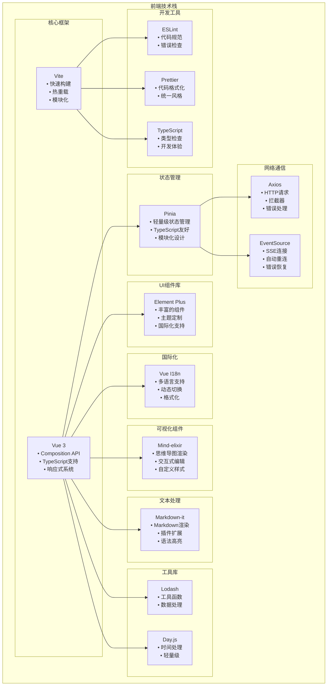

# ResVizCopilot 2.0 前端总体需求和架构设计

## 项目概述

ResVizCopilot 2.0 是一个基于大模型的科研智能体项目，前端采用 Vue 3 + Element Plus 技术栈，实现研究树可视化管理、智能体流式对话和工程存档管理三大核心功能。

### 核心特性

- **研究树可视化**：基于 Mind-elixir 的交互式思维导图，支持问题-解决方案层级结构
- **智能体流式对话**：基于 SSE 的实时流式交互，支持多智能体协作
- **工程存档管理**：完整的项目生命周期管理，支持版本控制和历史回溯
- **响应式设计**：支持桌面、平板、移动端的自适应布局
- **国际化支持**：中英文双语切换，可扩展多语言

## 技术架构

### 前端应用架构图


### 数据流架构图


### 前端技术栈架构图



### 技术栈选择

| 技术 | 版本 | 用途 |
|------|------|------|
| Vue 3 | ^3.3.0 | 核心框架，使用 Composition API |
| Vite | ^4.4.0 | 构建工具，快速开发和热重载 |
| Pinia | ^2.1.0 | 状态管理，替代 Vuex |
| Element Plus | ^2.3.0 | UI 组件库，丰富的组件生态 |
| Mind-elixir | ^1.0.0 | 思维导图可视化引擎 |
| Markdown-it | ^13.0.0 | Markdown 渲染引擎 |
| Axios | ^1.5.0 | HTTP 客户端 |
| Vue I18n | ^9.4.0 | 国际化解决方案 |
| TypeScript | ^5.0.0 | 类型检查和开发体验 |

### 整体架构设计

前端采用分层架构设计，从下到上分为：

1. **服务层（Service Layer）**：负责与后端 API 通信和数据处理
2. **状态管理层（State Management）**：使用 Pinia 管理全局状态
3. **组件层（Component Layer）**：可复用的 Vue 组件
4. **视图层（View Layer）**：页面级组件和路由管理

## 功能模块设计

### 1. 工程存档管理模块

#### 功能需求
- 工程的创建、保存、加载、删除
- 工程列表展示和搜索过滤
- 工程信息展示（名称、创建时间、更新时间、快照数量）
- 另存为功能，支持工程复制

#### 组件设计
```
ProjectManager.vue (主组件)
├── ProjectHeader.vue (工程操作头部)
├── ProjectList.vue (工程列表)
├── ProjectDialog.vue (工程对话框)
└── ProjectInfo.vue (工程信息展示)
```

#### 状态管理
```javascript
// projectStore.js
export const useProjectStore = defineStore('project', {
  state: () => ({
    currentProject: null,      // 当前工程信息
    projectList: [],          // 工程列表
    isLoading: false,         // 加载状态
    lastSaveTime: null        // 最后保存时间
  }),
  
  actions: {
    async createProject(name),
    async saveProject(),
    async loadProject(name),
    async deleteProject(name),
    async fetchProjectList()
  }
})
```

#### API 接口对接
- `POST /projects` - 创建工程
- `GET /projects` - 获取工程列表
- `GET /projects/{name}` - 加载工程
- `POST /projects/save` - 保存当前工程
- `POST /projects/save-as` - 另存为工程
- `DELETE /projects/{name}` - 删除工程

### 2. 研究树可视化模块

#### 功能需求
- 基于 Mind-elixir 的思维导图渲染
- 支持问题节点（实施问题、条件问题）和解决方案节点
- 节点样式区分：不同类型和状态的节点使用不同颜色和样式
- 交互式编辑：节点的创建、编辑、删除（受约束控制）
- 快照查看：临时显示历史快照状态
- 选中方案管理：可视化显示当前选中的解决方案

#### 组件设计
```
ResearchTree.vue (主组件)
├── TreeVisualization.vue (思维导图可视化)
├── TreeToolbar.vue (工具栏)
├── NodeEditor.vue (节点编辑器)
├── SnapshotViewer.vue (快照查看器)
└── TreeDataTransformer.js (数据转换服务)
```

#### 研究树数据转换架构图


#### 数据转换设计

**后端数据格式 → Mind-elixir 格式转换**

```javascript
// 后端快照数据结构
{
  id: "snapshot_id",
  created_at: "2024-01-01T00:00:00Z",
  roots: [
    {
      id: "node_id",
      type: "problem",
      title: "研究问题标题",
      problem_type: "implementation", // 或 "conditional"
      selected_solution_id: "solution_id",
      children: [...]
    }
  ]
}

// 转换为 Mind-elixir 格式
{
  nodeData: {
    id: "root",
    topic: "研究树",
    children: [
      {
        id: "node_id",
        topic: "研究问题标题",
        style: {
          backgroundColor: "#409eff", // 实施问题蓝色
          borderColor: "#409eff",
          color: "#ffffff"
        },
        children: [...]
      }
    ]
  }
}
```

#### 节点样式规范

| 节点类型 | 状态 | 背景色 | 边框色 | 文字色 |
|----------|------|--------|--------|--------|
| 实施问题 | 默认 | #409eff | #409eff | #ffffff |
| 条件问题 | 默认 | #e6a23c | #e6a23c | #ffffff |
| 解决方案 | 进行中 | #e6a23c | #e6a23c | #ffffff |
| 解决方案 | 成功 | #67c23a | #67c23a | #ffffff |
| 解决方案 | 失败 | #f56c6c | #f56c6c | #ffffff |
| 选中方案 | 任意 | 原色 | 加粗 3px | 原色 |

#### 交互约束实现

```javascript
// 约束验证器
class ConstraintValidator {
  // 条件问题不能有解决方案
  canAddSolution(problemNode) {
    return problemNode.problem_type === 'implementation';
  }
  
  // 根问题必须是实施类型
  canSetAsRoot(problemNode) {
    return problemNode.problem_type === 'implementation';
  }
  
  // 检查编辑权限
  canEditNode(nodeId) {
    return !this.isAgentWorking();
  }
}
```

### 3. 消息列表和AI对话模块

#### 功能需求
- 支持三种消息类型：用户消息、智能体消息、系统消息
- 消息结构：标题 → 内容 → 思考的三层展开结构
- 消息操作：查看快照、回溯消息、复制内容
- 智能体选择和节点选择
- SSE 流式数据接收和实时更新
- 终止生成功能

#### 组件设计
```
MessageCenter.vue (主组件)
├── MessageList.vue (消息列表)
│   └── MessageItem.vue (消息项)
│       ├── MessageHeader.vue (消息头部)
│       ├── MessageContent.vue (消息内容)
│       └── MessageActions.vue (消息操作)
├── ChatInput.vue (输入框)
├── AgentSelector.vue (智能体选择器)
├── NodeSelector.vue (节点选择器)
└── MarkdownRenderer.vue (Markdown渲染器)
```

#### 消息系统架构图


#### 消息数据结构

```javascript
// 消息对象结构
{
  id: "message_id",
  role: "user" | "assistant" | "system",
  publisher: "node_id", // 智能体消息的发布者节点
  status: "generating" | "completed" | "failed",
  title: "消息标题",
  thinking: "思考过程", // 可折叠，默认收起
  content: "消息内容", // 可折叠，默认展开
  action_title: "操作标题",
  action_params: {}, // 操作参数
  snapshot_id: "快照ID",
  visible_node_ids: [], // 可见节点列表
  created_at: "创建时间",
  updated_at: "更新时间"
}
```

#### SSE 流式数据处理

```javascript
// SSE 服务
class SSEService {
  constructor() {
    this.eventSource = null;
    this.reconnectAttempts = 0;
    this.maxReconnectAttempts = 5;
  }
  
  // 建立 SSE 连接
  connect(url) {
    this.eventSource = new EventSource(url);
    
    this.eventSource.onmessage = (event) => {
      const patch = JSON.parse(event.data);
      this.handlePatch(patch);
    };
    
    this.eventSource.onerror = () => {
      this.handleReconnect();
    };
  }
  
  // 处理补丁数据
  handlePatch(patch) {
    const messageStore = useMessageStore();
    messageStore.applyPatch(patch);
  }
  
  // 自动重连机制
  handleReconnect() {
    if (this.reconnectAttempts < this.maxReconnectAttempts) {
      setTimeout(() => {
        this.reconnectAttempts++;
        this.connect(this.lastUrl);
      }, Math.pow(2, this.reconnectAttempts) * 1000);
    }
  }
}
```

#### 智能体选择逻辑

```javascript
// 智能体配置
const AGENT_CONFIGS = {
  auto_research_agent: {
    name: "自动研究智能体",
    description: "为实施问题自动生成解决方案",
    requiresNode: true,
    nodeType: "problem",
    nodeFilter: (node) => node.problem_type === "implementation"
  },
  user_chat_agent: {
    name: "用户对话智能体",
    description: "与解决方案进行对话交流",
    requiresNode: true,
    nodeType: "solution",
    nodeFilter: (node) => node.type === "solution"
  }
};
```

## 状态管理设计

### 全局状态架构

使用 Pinia 进行模块化状态管理，主要包含以下 Store：

#### 1. 项目状态 (projectStore)
```javascript
export const useProjectStore = defineStore('project', {
  state: () => ({
    currentProject: null,
    projectList: [],
    isLoading: false,
    lastSaveTime: null
  })
});
```

#### 2. 研究树状态 (treeStore)
```javascript
export const useTreeStore = defineStore('tree', {
  state: () => ({
    currentSnapshot: null,
    mindElixirData: null,
    selectedNodeId: null,
    isViewingSnapshot: false,
    tempSnapshotId: null
  })
});
```

#### 3. 消息状态 (messageStore)
```javascript
export const useMessageStore = defineStore('message', {
  state: () => ({
    messages: [],
    isGenerating: false,
    currentAgentName: null,
    sseConnection: null
  })
});
```

#### 4. UI状态 (uiStore)
```javascript
export const useUIStore = defineStore('ui', {
  state: () => ({
    theme: 'light',
    language: 'zh-CN',
    leftPanelCollapsed: false,
    rightPanelCollapsed: false,
    isLoading: false,
    loadingText: ''
  })
});
```

### UI状态管理图


### 状态互斥控制

为确保操作的互斥性，实现全局状态锁机制：

```javascript
// 状态锁管理器
class StateLockManager {
  constructor() {
    this.locks = new Set();
  }
  
  // 获取锁
  acquireLock(lockName) {
    if (this.locks.has(lockName)) {
      throw new Error(`操作冲突：${lockName} 正在进行中`);
    }
    this.locks.add(lockName);
  }
  
  // 释放锁
  releaseLock(lockName) {
    this.locks.delete(lockName);
  }
  
  // 检查锁状态
  isLocked(lockName) {
    return this.locks.has(lockName);
  }
}

// 使用示例
const lockManager = new StateLockManager();

// 智能体工作时禁用其他操作
if (lockManager.isLocked('agent_working')) {
  // 禁用研究树编辑
  // 禁用工程切换
  // 禁用其他智能体调用
}
```

## 用户界面设计

### 整体布局

采用经典的三栏布局设计：

```
┌─────────────────────────────────────────────────────────────┐
│                        应用头部                              │
│  项目标题 | 工程管理 | 语言切换 | 主题切换                    │
├─────────────┬─────────────────────────┬─────────────────────┤
│             │                         │                     │
│   左侧面板   │        中央面板          │      右侧面板        │
│             │                         │                     │
│  工程管理    │      研究树可视化        │    消息列表对话      │
│             │                         │                     │
│  • 当前工程  │  • 思维导图画布          │  • 智能体选择        │
│  • 工程列表  │  • 工具栏               │  • 消息列表          │
│  • 操作按钮  │  • 节点编辑面板          │  • 输入框            │
│             │                         │                     │
│   300px     │        自适应            │       400px         │
│  可折叠      │      最小600px          │      可折叠          │
└─────────────┴─────────────────────────┴─────────────────────┘
```

### 响应式设计

#### 桌面端 (≥1200px)
- 三栏布局，所有功能完整展示
- 侧边栏可折叠，节省空间
- 支持快捷键操作

#### 平板端 (768px-1199px)
- 两栏布局，左侧面板改为抽屉式
- 中央面板和右侧面板并排显示
- 触摸友好的交互设计

#### 移动端 (<768px)
- 单栏布局，使用标签页切换
- 底部导航栏，快速切换功能模块
- 优化触摸操作体验

### 视觉设计规范图


### 主题设计

#### 亮色主题
```css
:root {
  --bg-color: #ffffff;
  --text-color: #303133;
  --border-color: #dcdfe6;
  --shadow-color: rgba(0, 0, 0, 0.1);
  --primary-color: #409eff;
  --success-color: #67c23a;
  --warning-color: #e6a23c;
  --danger-color: #f56c6c;
}
```

#### 暗色主题
```css
:root[data-theme="dark"] {
  --bg-color: #1a1a1a;
  --text-color: #e4e7ed;
  --border-color: #4c4d4f;
  --shadow-color: rgba(0, 0, 0, 0.3);
  --primary-color: #409eff;
  --success-color: #67c23a;
  --warning-color: #e6a23c;
  --danger-color: #f56c6c;
}
```

## 交互流程设计

### 智能体调用时序图


### 研究树交互时序图


### 智能体调用流程

1. **准备阶段**
   - 用户选择智能体类型
   - 根据智能体要求选择目标节点
   - 输入调用内容

2. **调用阶段**
   - 发送 POST 请求到 `/agents/messages`
   - 建立 SSE 连接接收流式数据
   - 实时更新消息内容

3. **处理阶段**
   - 接收 patch 事件更新消息
   - 处理数据库操作结果
   - 更新研究树状态

4. **完成阶段**
   - 接收 finished 事件
   - 释放界面锁定
   - 显示最终结果

### 研究树编辑流程

1. **选择节点**
   - 点击思维导图节点
   - 显示节点详情面板
   - 检查编辑权限

2. **编辑操作**
   - 修改节点内容
   - 验证输入合法性
   - 检查约束条件

3. **保存更改**
   - 发送更新请求
   - 接收新快照数据
   - 更新思维导图显示

4. **错误处理**
   - 显示错误信息
   - 回滚到原始状态
   - 提供重试选项

### 快照查看流程

1. **触发查看**
   - 点击消息的"查看快照"按钮
   - 获取快照ID

2. **临时显示**
   - 请求快照数据
   - 转换为思维导图格式
   - 临时替换当前显示

3. **状态提示**
   - 显示"正在查看历史快照"提示
   - 提供返回当前状态按钮
   - 禁用编辑操作

4. **退出查看**
   - 恢复当前快照显示
   - 移除临时状态提示
   - 重新启用编辑功能

## 性能优化策略

### 1. 组件懒加载
```javascript
// 路由级别的懒加载
const routes = [
  {
    path: '/project',
    component: () => import('@/views/ProjectView.vue')
  }
];

// 组件级别的懒加载
const NodeEditor = defineAsyncComponent(() => 
  import('@/components/NodeEditor.vue')
);
```

### 2. 虚拟滚动
```javascript
// 消息列表使用虚拟滚动
<virtual-list
  :data-sources="messages"
  :data-key="'id'"
  :keeps="30"
  :estimate-size="100"
>
  <template #item="{ record }">
    <MessageItem :message="record" />
  </template>
</virtual-list>
```

### 3. 防抖和节流
```javascript
// 搜索输入防抖
const debouncedSearch = debounce((query) => {
  searchProjects(query);
}, 300);

// 滚动事件节流
const throttledScroll = throttle((event) => {
  handleScroll(event);
}, 100);
```

### 4. 缓存策略
```javascript
// API 响应缓存
const apiCache = new Map();

async function cachedRequest(url, options = {}) {
  const cacheKey = `${url}_${JSON.stringify(options)}`;
  
  if (apiCache.has(cacheKey)) {
    return apiCache.get(cacheKey);
  }
  
  const response = await fetch(url, options);
  const data = await response.json();
  
  apiCache.set(cacheKey, data);
  return data;
}
```

## 错误处理和用户反馈

### 1. 全局错误处理
```javascript
// 全局错误处理器
app.config.errorHandler = (err, vm, info) => {
  console.error('全局错误:', err);
  
  // 显示用户友好的错误信息
  ElMessage.error('操作失败，请稍后重试');
  
  // 发送错误报告（可选）
  reportError(err, vm, info);
};
```

### 2. API 错误处理
```javascript
// HTTP 拦截器
axios.interceptors.response.use(
  response => response,
  error => {
    const { status, data } = error.response || {};
    
    switch (status) {
      case 400:
        ElMessage.error(data.detail || '请求参数错误');
        break;
      case 401:
        ElMessage.error('未授权访问');
        break;
      case 404:
        ElMessage.error('请求的资源不存在');
        break;
      case 500:
        ElMessage.error('服务器内部错误');
        break;
      default:
        ElMessage.error('网络错误，请检查连接');
    }
    
    return Promise.reject(error);
  }
);
```

### 3. 用户反馈机制
```javascript
// 操作成功反馈
const showSuccess = (message) => {
  ElMessage.success(message);
};

// 操作确认对话框
const confirmAction = async (message, title = '确认操作') => {
  try {
    await ElMessageBox.confirm(message, title, {
      confirmButtonText: '确定',
      cancelButtonText: '取消',
      type: 'warning'
    });
    return true;
  } catch {
    return false;
  }
};

// 加载状态指示
const showLoading = (text = '加载中...') => {
  return ElLoading.service({
    lock: true,
    text,
    background: 'rgba(0, 0, 0, 0.7)'
  });
};
```

## 国际化设计

### 1. 语言配置
```javascript
// i18n 配置
const messages = {
  'zh-CN': {
    app: {
      title: 'ResVizCopilot 2.0',
      loading: '加载中...',
      save: '保存',
      cancel: '取消'
    },
    project: {
      create: '创建工程',
      save: '保存工程',
      load: '加载工程'
    },
    tree: {
      problem: '问题',
      solution: '解决方案',
      edit: '编辑节点'
    },
    message: {
      user: '用户',
      agent: '智能体',
      system: '系统'
    }
  },
  'en-US': {
    app: {
      title: 'ResVizCopilot 2.0',
      loading: 'Loading...',
      save: 'Save',
      cancel: 'Cancel'
    },
    project: {
      create: 'Create Project',
      save: 'Save Project',
      load: 'Load Project'
    },
    tree: {
      problem: 'Problem',
      solution: 'Solution',
      edit: 'Edit Node'
    },
    message: {
      user: 'User',
      agent: 'Agent',
      system: 'System'
    }
  }
};
```

### 2. 动态语言切换
```javascript
// 语言切换组件
const LanguageSelector = {
  setup() {
    const { locale } = useI18n();
    
    const changeLanguage = (lang) => {
      locale.value = lang;
      localStorage.setItem('language', lang);
    };
    
    return { locale, changeLanguage };
  }
};
```

## 测试策略

### 1. 单元测试
```javascript
// 组件测试示例
import { mount } from '@vue/test-utils';
import MessageItem from '@/components/MessageItem.vue';

describe('MessageItem', () => {
  it('should render user message correctly', () => {
    const wrapper = mount(MessageItem, {
      props: {
        message: {
          id: '1',
          role: 'user',
          title: '测试消息',
          content: '这是一条测试消息'
        }
      }
    });
    
    expect(wrapper.find('.message-title').text()).toBe('测试消息');
    expect(wrapper.find('.message-content').text()).toBe('这是一条测试消息');
  });
});
```

### 2. 集成测试
```javascript
// API 集成测试
describe('Project API', () => {
  it('should create project successfully', async () => {
    const projectStore = useProjectStore();
    const result = await projectStore.createProject('测试工程');
    
    expect(result.success).toBe(true);
    expect(projectStore.currentProject.name).toBe('测试工程');
  });
});
```

### 3. E2E 测试
```javascript
// Cypress E2E 测试
describe('Research Tree Interaction', () => {
  it('should allow user to edit node', () => {
    cy.visit('/');
    cy.get('[data-testid="tree-node"]').first().click();
    cy.get('[data-testid="node-editor"]').should('be.visible');
    cy.get('[data-testid="node-title-input"]').clear().type('新标题');
    cy.get('[data-testid="save-button"]').click();
    cy.get('[data-testid="tree-node"]').should('contain', '新标题');
  });
});
```

## 部署和构建

### 1. 构建配置
```javascript
// vite.config.js
export default defineConfig({
  plugins: [vue()],
  build: {
    target: 'es2015',
    outDir: 'dist',
    assetsDir: 'assets',
    sourcemap: false,
    minify: 'terser',
    rollupOptions: {
      output: {
        manualChunks: {
          vendor: ['vue', 'vue-router', 'pinia'],
          ui: ['element-plus'],
          utils: ['axios', 'lodash']
        }
      }
    }
  }
});
```

### 2. 环境配置
```javascript
// .env.production
VITE_API_BASE_URL=https://api.resvizcopilot.com
VITE_SSE_BASE_URL=https://sse.resvizcopilot.com
VITE_APP_TITLE=ResVizCopilot 2.0

// .env.development
VITE_API_BASE_URL=http://localhost:8008
VITE_SSE_BASE_URL=http://localhost:8008
VITE_APP_TITLE=ResVizCopilot 2.0 (Dev)
```

### 3. Docker 部署
```dockerfile
# Dockerfile
FROM node:18-alpine as builder

WORKDIR /app
COPY package*.json ./
RUN npm ci --only=production

COPY . .
RUN npm run build

FROM nginx:alpine
COPY --from=builder /app/dist /usr/share/nginx/html
COPY nginx.conf /etc/nginx/nginx.conf

EXPOSE 80
CMD ["nginx", "-g", "daemon off;"]
```

## 总结

本设计文档详细规划了 ResVizCopilot 2.0 前端的整体架构、技术选型、功能模块、交互流程和实现细节。主要特点包括：

### 技术亮点
1. **现代化技术栈**：Vue 3 + Composition API + TypeScript，提供优秀的开发体验
2. **模块化架构**：清晰的分层设计，组件解耦，易于维护和扩展
3. **响应式设计**：支持多端适配，提供一致的用户体验
4. **实时交互**：基于 SSE 的流式数据处理，实现智能体实时对话
5. **可视化创新**：基于 Mind-elixir 的研究树可视化，直观展示复杂的问题-解决方案关系

### 设计原则
1. **用户体验优先**：界面简洁直观，操作流程顺畅
2. **性能优化**：虚拟滚动、懒加载、缓存策略等多重优化
3. **错误处理**：完善的错误处理和用户反馈机制
4. **可维护性**：模块化设计，代码规范，完善的测试覆盖
5. **可扩展性**：插件化架构，支持功能扩展和定制

### 创新特性
1. **智能体协作**：支持多智能体协同工作，实现复杂的研究流程自动化
2. **约束驱动**：基于业务规则的交互约束，确保数据一致性
3. **快照机制**：完整的历史版本管理，支持任意时点的状态回溯
4. **流式交互**：实时的智能体对话体验，支持中断和恢复
5. **数据转换**：后端数据与前端可视化的无缝转换

该设计方案充分考虑了项目的复杂性和扩展性需求，为后续的开发实施提供了清晰的指导和规范。通过合理的架构设计和技术选型，能够确保项目的高质量交付和长期可维护性。
