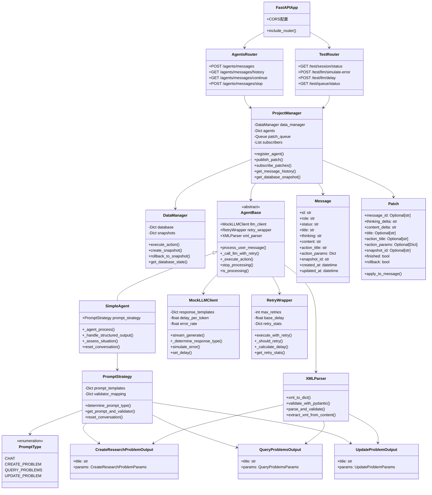
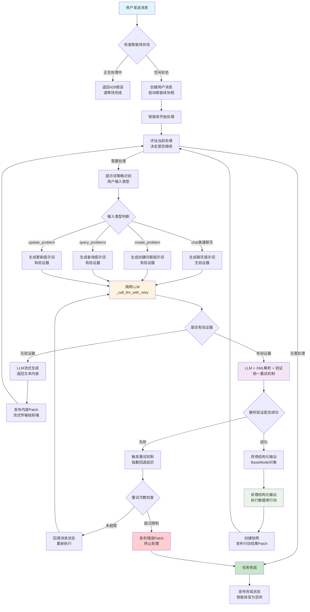
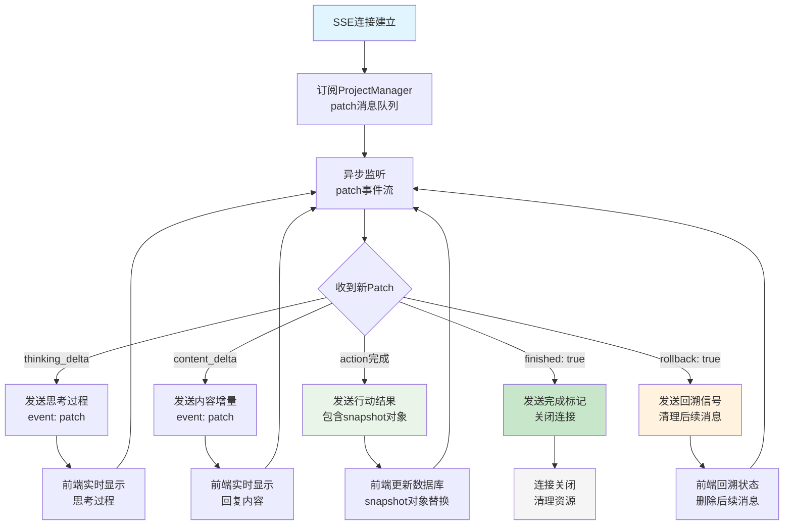
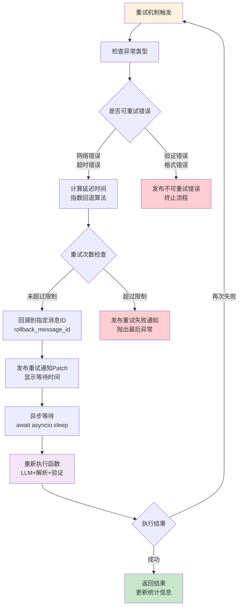
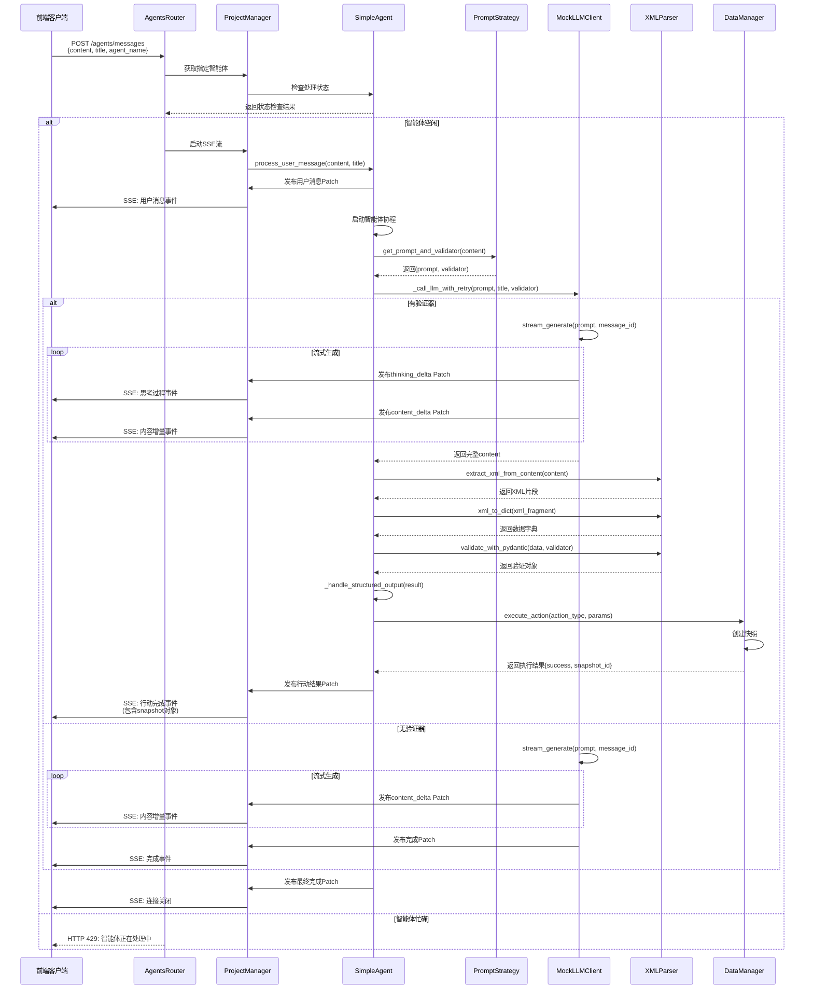
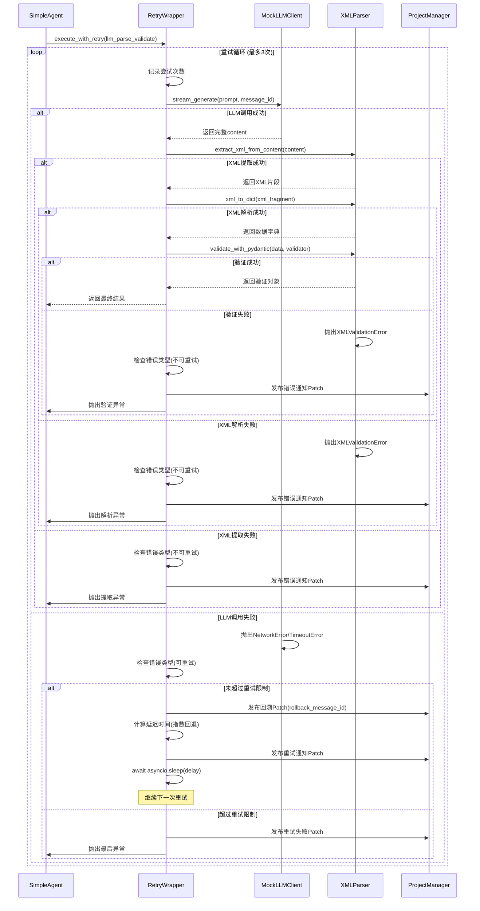

# ResVizCopilot 2.0 流式智能体系统

## 🎯 项目概述

基于ProjectManager架构的智能体流式传输系统，支持SSE协程解耦、XML解析验证、错误重试和快照管理的完整解决方案。

**核心特性**：
- 🔄 统一重试机制（LLM调用+解析+验证）
- 🎭 智能提示词策略（自动识别输入类型）
- 📝 PydanticV2验证器体系（类型安全保障）
- 🔗 SSE流式传输（协程独立运行）
- 📸 快照对象管理（状态回溯支持）

---

## 📡 接口定义

### 智能体交互接口

#### 发送消息 - SSE流式响应
```http
POST /agents/messages
Content-Type: application/json

{
  "content": "用户消息内容",
  "title": "消息标题",
  "agent_name": "default"
}
```

**响应**: `text/event-stream` 格式
```javascript
data: {
  "event": "patch",
  "data": {
    "message_id": "uuid",
    "thinking_delta": "思考过程增量",
    "content_delta": "内容增量", 
    "action_title": "行动标题",
    "snapshot_id": "快照ID",
    "finished": true
  }
}
```

#### 获取消息历史
```http
GET /agents/messages/history
```

#### 继续未完成消息
```http
GET /agents/messages/continue/{message_id}
```

#### 停止生成
```http
POST /agents/messages/stop
```

### 测试调试接口

#### 会话状态查询
```http
GET /test/session/status
```

#### LLM错误模拟
```http
POST /test/llm/simulate-error
Content-Type: application/json

{
  "error_rate": 0.3,
  "error_types": ["network", "timeout", "api_error"]
}
```

#### 延迟配置
```http
POST /test/llm/delay
Content-Type: application/json

{
  "delay_per_token": 0.05
}
```

---

## 🏗️ 系统架构

### 整体架构类图



### 架构分层说明

| 层级 | 组件 | 职责 |
|------|------|------|
| **路由层** | FastAPI + Routers | HTTP接口暴露，请求路由分发 |
| **管理层** | ProjectManager + DataManager | 消息管理，数据持久化，快照控制 |
| **智能体层** | AgentBase + SimpleAgent | 业务逻辑处理，智能决策 |
| **策略层** | PromptStrategy + Validators | 提示词选择，输出验证 |
| **工具层** | LLMClient + RetryWrapper + XMLParser | 基础服务，重试机制，数据解析 |
| **模型层** | Message + Patch | 数据结构定义，状态管理 |

---

## 🔄 核心流程

### 智能体处理流程



### SSE流式传输流程



### 重试机制流程



---

## ⏱️ 交互时序

### 完整消息处理时序



### 重试机制时序



---

## 🧪 测试体系

### 测试架构

| 测试类型 | 文件 | 覆盖范围 | 运行方式 |
|----------|------|----------|----------|
| **单元测试** | `test_unit.py` | 组件独立功能 | `pytest tests/test_unit.py -v` |
| **集成测试** | `test_integration.py` | 端到端流程 | `pytest tests/test_integration.py -v` |
| **API测试** | `test_api.py` | HTTP接口 | `pytest tests/test_api.py -v` |
| **快速验证** | `quick_test.py` | 核心功能 | `python quick_test.py` |

### 单元测试用例

#### 1. 消息模型测试 (TestMessage)
```bash
# 测试消息创建和补丁应用
pytest tests/test_unit.py::TestMessage::test_message_creation -v
pytest tests/test_unit.py::TestMessage::test_patch_application -v
```

**测试内容**：
- ✅ Message对象创建和字段验证
- ✅ Patch补丁应用逻辑
- ✅ 增量更新vs替换更新机制
- ✅ 时间戳自动更新

#### 2. 智能体验证器测试 (TestSimpleAgentValidators)
```bash
# 测试验证器和提示词策略
pytest tests/test_unit.py::TestSimpleAgentValidators -v
```

**测试内容**：
- ✅ CreateResearchProblemOutput验证器
- ✅ PydanticV2字段验证规则
- ✅ PromptStrategy输入类型识别
- ✅ 提示词模板选择逻辑

#### 3. 数据管理器测试 (TestDataManager)
```bash
# 测试数据持久化和快照
pytest tests/test_unit.py::TestDataManager -v
```

**测试内容**：
- ✅ 研究问题CRUD操作
- ✅ 快照创建和回溯
- ✅ 数据库状态管理
- ✅ 执行结果返回格式

#### 4. 项目管理器测试 (TestProjectManager)
```bash
# 测试消息管理和发布订阅
pytest tests/test_unit.py::TestProjectManager -v
```

**测试内容**：
- ✅ 消息历史管理
- ✅ Patch发布订阅机制
- ✅ 智能体注册和获取
- ✅ 并发消息处理

#### 5. XML解析器测试 (TestXMLParser)
```bash
# 测试XML解析和验证
pytest tests/test_unit.py::TestXMLParser -v
```

**测试内容**：
- ✅ XML转字典解析
- ✅ PydanticV2验证集成
- ✅ XML片段提取
- ✅ 错误处理和异常

#### 6. 重试机制测试 (TestRetryWrapper)
```bash
# 测试重试逻辑
pytest tests/test_unit.py::TestRetryWrapper -v
```

**测试内容**：
- ✅ 指数回退算法
- ✅ 可重试vs不可重试错误
- ✅ 重试统计信息
- ✅ 回溯机制

### 集成测试用例

#### 1. 基本消息流程测试
```bash
pytest tests/test_integration.py::TestIntegration::test_basic_message_flow -v
```

**测试内容**：
- 🔄 用户消息→智能体处理→响应生成
- 🔄 SSE流式传输完整链路
- 🔄 Patch发布订阅机制
- 🔄 消息历史记录

#### 2. XML解析和行动执行测试
```bash
pytest tests/test_integration.py::TestIntegration::test_xml_parsing_and_action_execution -v
```

**测试内容**：
- 🔄 提示词策略自动识别
- 🔄 LLM生成→XML解析→验证
- 🔄 结构化输出→数据库行动
- 🔄 快照创建和前端同步

#### 3. 错误重试机制测试
```bash
pytest tests/test_integration.py::TestIntegration::test_error_retry_mechanism -v
```

**测试内容**：
- 🔄 网络错误模拟和重试
- 🔄 重试通知消息发布
- 🔄 指数回退延迟验证
- 🔄 重试失败处理

#### 4. SSE断连重连测试
```bash
pytest tests/test_integration.py::TestIntegration::test_sse_reconnection -v
```

**测试内容**：
- 🔄 连接中断模拟
- 🔄 继续消息功能
- 🔄 历史状态同步
- 🔄 实时流恢复

### API测试用例

#### 1. 基本接口测试
```bash
pytest tests/test_api.py::TestAPI::test_root_endpoint -v
pytest tests/test_api.py::TestAPI::test_health_check -v
```

#### 2. 智能体接口测试
```bash
pytest tests/test_api.py::TestAPI::test_send_message -v
pytest tests/test_api.py::TestAPI::test_message_history -v
pytest tests/test_api.py::TestAPI::test_stop_generation -v
```

#### 3. 测试接口验证
```bash
pytest tests/test_api.py::TestAPI::test_session_status -v
pytest tests/test_api.py::TestAPI::test_llm_configuration -v
```

### 快速验证脚本

```bash
# 运行所有核心功能验证
python quick_test.py
```

**验证项目**：
- ✅ 验证器功能测试
- ✅ 提示词策略测试  
- ✅ XML解析测试
- ✅ LLM输出测试

### 批量测试运行

#### 运行所有测试
```bash
# 运行完整测试套件
pytest tests/ -v

# 并行运行加速
pytest tests/ -v -n auto
```

#### 按类型运行
```bash
# 仅单元测试
pytest tests/test_unit.py -v

# 仅集成测试  
pytest tests/test_integration.py -v

# 仅API测试
pytest tests/test_api.py -v
```

#### 按功能模块运行
```bash
# 测试智能体相关
pytest -k "agent" -v

# 测试消息处理
pytest -k "message" -v

# 测试XML解析
pytest -k "xml" -v

# 测试重试机制
pytest -k "retry" -v
```

### 测试配置和环境

#### 启动测试服务器
```bash
# 启动开发服务器
python main.py

# 服务器运行在 http://localhost:8080
```

#### 测试数据准备
```bash
# 重置测试环境
rm -rf __pycache__ tests/__pycache__

# 安装依赖
pip install -r requirements.txt
```

#### 调试模式运行
```bash
# 详细输出模式
pytest tests/ -v -s

# 遇到失败时停止
pytest tests/ -v -x

# 重新运行失败的测试
pytest tests/ --lf
```

---

## 🚀 快速开始

### 环境准备

```bash
# 1. 进入项目目录
cd /path/to/ResVizCopilot-2.0.0/tests/stream_case2

# 2. 安装依赖
pip install -r requirements.txt

# 3. 验证核心功能
python quick_test.py
```

### 启动服务

```bash
# 启动开发服务器
python main.py

# 服务运行在 http://localhost:8080
```

### 使用示例

#### 1. 发送消息（普通聊天）
```bash
curl -X POST "http://localhost:8080/agents/messages" \
  -H "Content-Type: application/json" \
  -d '{"content": "你好", "title": "问候"}'
```

#### 2. 发送消息（创建研究问题）
```bash
curl -X POST "http://localhost:8080/agents/messages" \
  -H "Content-Type: application/json" \
  -d '{"content": "请创建一个关于AI安全的研究问题", "title": "创建研究问题"}'
```

#### 3. 查看消息历史
```bash
curl "http://localhost:8080/agents/messages/history"
```

#### 4. 获取会话状态
```bash
curl "http://localhost:8080/test/session/status"
```

### 前端集成示例

```javascript
// SSE连接示例
const eventSource = new EventSource('/agents/messages');

eventSource.onmessage = function(event) {
    const data = JSON.parse(event.data);
    
    if (data.event === 'patch') {
        const patch = data.data;
        
        // 处理不同类型的更新
        if (patch.thinking_delta) {
            updateThinking(patch.thinking_delta);
        }
        
        if (patch.content_delta) {
            updateContent(patch.content_delta);
        }
        
        if (patch.action_title && patch.snapshot) {
            updateDatabase(patch.snapshot);
        }
        
        if (patch.finished) {
            eventSource.close();
        }
    }
};

// 发送消息
async function sendMessage(content) {
    const response = await fetch('/agents/messages', {
        method: 'POST',
        headers: {'Content-Type': 'application/json'},
        body: JSON.stringify({
            content: content,
            title: '用户消息',
            agent_name: 'default'
        })
    });
    
    return response;
}
```

### 开发调试

#### 配置LLM模拟错误
```bash
curl -X POST "http://localhost:8080/test/llm/simulate-error" \
  -H "Content-Type: application/json" \
  -d '{"error_rate": 0.3, "error_types": ["network", "timeout"]}'
```

#### 调整响应延迟
```bash
curl -X POST "http://localhost:8080/test/llm/delay" \
  -H "Content-Type: application/json" \
  -d '{"delay_per_token": 0.1}'
```

#### 停止生成
```bash
curl -X POST "http://localhost:8080/agents/messages/stop"
```

---

## 📈 性能特性

### 核心优势

| 特性 | 传统方案 | 本方案 | 改进效果 |
|------|----------|---------|----------|
| **重试范围** | 单独重试LLM | LLM+解析+验证统一重试 | 🔄 更完整的错误恢复 |
| **类型安全** | 手动解析验证 | PydanticV2自动验证 | ✅ 零运行时类型错误 |
| **提示词管理** | 硬编码模板 | 智能策略选择 | 🎯 自适应输入处理 |
| **流式传输** | 简单SSE | ProjectManager解耦 | ⚡ 协程独立运行 |
| **错误处理** | 基础重试 | 指数回退+分类处理 | 🛡️ 更强错误恢复能力 |

### 扩展性设计

- **模块化架构**：各层职责清晰，易于替换和扩展
- **插件化验证器**：新行动类型仅需添加验证器
- **策略模式**：提示词策略独立，支持动态扩展
- **统一接口**：AgentBase抽象接口，支持多种智能体实现

---

## 🏆 项目总结

ResVizCopilot 2.0流式智能体系统通过重图表轻文字的设计理念，提供了一套完整的智能体协程解耦解决方案。

### 🎯 核心成就

- **🔄 统一重试机制**：LLM调用、XML解析、验证一体化重试
- **🎭 智能提示词策略**：自动识别输入类型，选择最佳处理方式  
- **📝 类型安全验证**：PydanticV2确保输出格式完全可控
- **🔗 SSE协程解耦**：智能体独立运行，前端实时响应
- **📸 快照状态管理**：支持状态回溯和错误恢复

### 🛠️ 技术价值

通过丰富的**Mermaid图表**展示系统设计：
- **类图**：清晰展现组件关系和职责分工
- **流程图**：详细描述核心业务逻辑和处理流程
- **时序图**：完整呈现组件间交互和消息流转

### 🧪 测试保障

全面的测试体系确保系统稳定性：
- **单元测试**：组件功能验证
- **集成测试**：端到端流程验证  
- **API测试**：接口规范验证
- **快速验证**：核心功能一键检查

该系统为智能体协程解耦提供了一个**健壮、可扩展、易维护**的完整解决方案。
