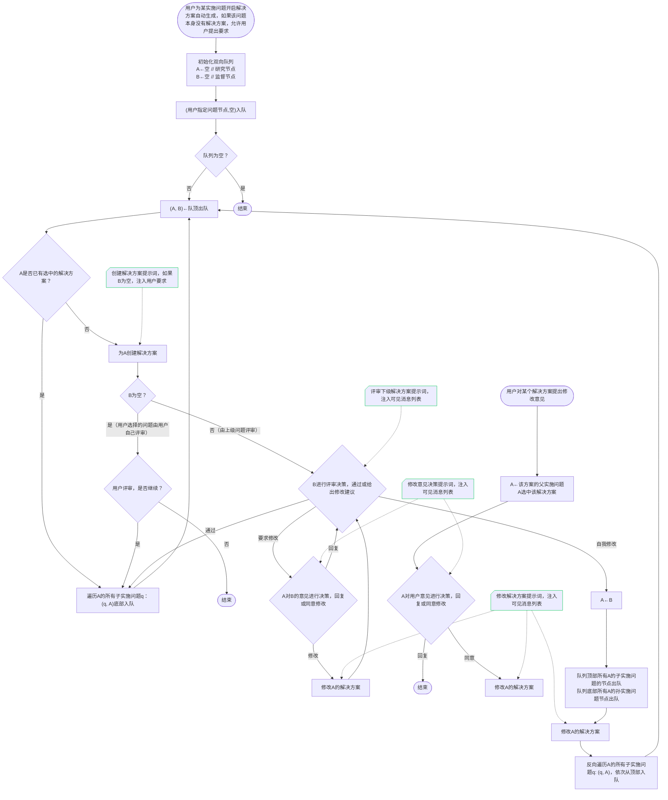

# ResVizCopilot 2.0 总体需求和架构设计

## 项目概述

ResVizCopilot是一个科研智能体项目，旨在帮助研究人员管理研究问题和解决方案，通过智能体协程和流式传输技术提供流畅的用户体验。项目采用前后端分离架构，前端基于Vue.js和ElementPlus，后端基于Python FastAPI，集成DeepSeek大模型提供智能交互能力。

## 基本环境和项目风格

### 设计思路说明

**为什么选择这些技术栈？**

**设计目的**：构建现代化、高性能、易维护的科研智能体系统

**技术考虑**：
1. **前端技术**：Vue.js + ElementPlus提供丰富的组件和良好的开发体验
2. **后端技术**：FastAPI提供高性能的异步API和自动文档生成
3. **大模型集成**：DeepSeek提供强大的推理和生成能力
4. **开发工具**：pytest提供全面的测试支持，确保代码质量

### 技术栈详细说明

#### 前端技术栈
- **Vue.js架构**：采用Vue 3 Composition API，提供响应式数据绑定和组件化开发
- **ElementPlus组件库**：提供丰富的UI组件，确保界面的一致性和美观性
- **运行端口**：8080端口，避免与常见服务端口冲突
- **代理配置**：通过vue.config.js配置代理，解决开发环境的跨域问题

#### 后端技术栈
- **Python + FastAPI**：提供高性能的异步API框架，支持WebSocket和SSE
- **运行端口**：8008端口，与前端端口区分，便于开发和部署
- **环境管理**：使用base conda环境，确保依赖的一致性和可重现性
- **异步支持**：充分利用Python的asyncio，支持高并发和流式处理

#### 大模型集成
- **DeepSeek模型**：主要使用DeepSeek的推理和生成能力
- **模型选择策略**：
  - 复杂任务使用r1模型：提供更强的推理和规划能力
  - 简单操作使用v3模型：提供更快的响应和更低的成本
- **通信格式**：广泛使用XML风格的提示词和输出格式，便于解析和验证

#### 开发工具和流程
- **pytest测试框架**：提供全面的单元测试和集成测试支持
- **代码质量**：使用类型提示、代码格式化工具等确保代码质量
- **文档生成**：FastAPI自动生成API文档，便于前后端协作

### 开发风格和流程

#### 开发方法论
**设计思路**：采用渐进式开发，先验证关键技术，再整合完整功能

**具体流程**：
1. **功能设计**：明确功能需求和接口设计
2. **架构设计**：设计系统架构和组件关系
3. **技术验证**：用最简案例验证关键技术
4. **代码实现**：基于验证结果实现完整功能
5. **单元测试**：使用pytest进行全面的单元测试
6. **集成测试**：验证模块间的协作和接口兼容性

#### 代码质量保证
**设计思路**：通过多种手段确保代码质量和系统稳定性

**具体措施**：
- **类型安全**：使用Python类型提示和Pydantic验证
- **测试覆盖**：每个模块都有对应的测试用例
- **错误处理**：完善的异常处理和错误重试机制
- **代码规范**：遵循PEP 8等Python编码规范
- **文档注释**：详细的中文注释，便于团队协作

### 项目结构设计

#### 目录组织原则
**设计思路**：按功能模块组织代码，确保职责清晰和易于维护

**具体结构**：(暂时，需随项目开发不断更新)
```
ResVizCopilot-2.0.0/
├── frontend/                                 # 前端Vue.js应用
├── backend/                                  # 后端FastAPI应用
│   ├── main.py                              # 主应用入口，配置路由和中间件
│   ├── routers/                             # 路由模块，按功能分组
│   │   ├── agents.py                       # 智能体相关路由
│   │   ├── research_tree.py                # 研究树数据库路由
│   │   └── projects.py                     # 工程管理路由
│   ├── agents/                              # 智能体相关代码
│   │   ├── prompts/                        # 提示词管理（待设计）
│   │   ├── schemas/                        # 数据模型和序列化
│   │   │   ├── output.py                   # 验证大模型输出规范
│   │   │   └── 其它待设计模型...
│   ├── database/                            # 数据库相关代码
│   │   ├── DatabaseManager.py              # 数据库管理器
│   │   └── schemas/                        # 数据模型和序列化
│   │       └── research_tree.py
│   └── data/                                # 数据存储
│       └── projects/                       # 工程文件存储
├── tests/                                   # 单元测试和集成测试
└── 总体需求和架构设计.md                     # 项目设计文档
```
==需要补充环境变量相关的文件和文件夹==


#### 模块职责划分
**设计思路**：每个模块都有明确的职责边界，避免功能重复和耦合

**具体划分**：
- **routers模块**：负责HTTP路由和请求处理
- **agents模块**：负责智能体逻辑和LLM交互
- **database模块**：负责数据存储和状态管理
- **schemas模块**：负责数据模型定义和验证
- **tests模块**：负责代码测试和质量保证

### 配置和环境管理

#### 环境变量配置
**设计思路**：通过环境变量管理配置，支持不同环境的灵活部署

**配置内容**：
- 数据库连接配置
- 大模型API密钥和配置
- 服务端口和主机配置
- 日志级别和输出配置
- 开发/生产环境标识

#### 配置文件管理
**设计思路**：使用Pydantic BaseSettings管理配置，提供类型安全和验证

**实现方式**：
- 创建settings.py文件，定义配置模型
- 支持.env文件和环境变量
- 提供配置验证和默认值
- 支持配置的热重载


## 设计思路说明

### 为什么采用智能体协程独立于SSE传输的架构？

**设计目的**：确保系统的稳定性和用户体验的连续性

**技术考虑**：
1. **前端断连不影响智能体运行**：用户网络不稳定或刷新页面时，智能体继续执行任务
2. **消息管道解耦**：通过异步消息队列实现智能体与传输层的解耦
3. **支持断连重连**：前端重连后可以无缝继续接收智能体输出
4. **提高系统容错性**：避免因传输问题导致智能体任务中断

**实现方式**：
- 智能体协程完全独立运行，通过消息管道与SSE传输层通信
- 使用`asyncio.Queue`实现消息管道，支持多消费者模式
- SSE传输层监听消息管道，实时向前端推送更新

### 为什么使用指数回退重试机制？

**设计目的**：提高系统在外部服务不稳定时的可靠性

**技术考虑**：
1. **LLM服务稳定性**：大模型API可能存在临时性故障
2. **网络波动**：网络环境不稳定时的自动恢复
3. **避免雪崩效应**：防止重试请求对服务造成更大压力

**实现方式**：
- 基础延迟 × (回退因子 ^ 重试次数)，但不超过最大延迟
- 可配置重试次数、基础延迟、最大延迟、回退因子
- 支持自定义可重试异常类型

### 为什么采用行动识别与自动执行机制？

**设计目的**：实现智能体与数据库的自动化交互

**技术考虑**：
1. **减少人工干预**：智能体可以直接执行数据库操作
2. **提高响应速度**：避免用户手动执行智能体建议的操作
3. **保持数据一致性**：通过统一的行动执行器确保操作规范

**实现方式**：
- 从LLM输出中解析XML格式的行动指令
- 支持数据库操作和系统命令的自动识别
- 通过ActionExecutor统一执行，确保安全性

## 前后端接口设计

### 设计思路说明

**为什么采用分层接口设计？**

**设计目的**：实现功能模块的清晰分离和职责明确

**技术考虑**：
1. **数据库操作接口**：直接操作研究树数据，支持CRUD操作
2. **智能体调用接口**：通过SSE实现流式交互，支持复杂的智能体逻辑
3. **工程管理接口**：管理项目的保存、加载、版本控制等

**实现方式**：
- 每个接口模块都有明确的职责边界
- 使用统一的响应模型和错误处理
- 支持快照机制，确保数据操作的可追溯性

### 直接操作数据库接口

**设计思路**：提供研究树数据的基础CRUD操作，所有修改操作都通过快照机制记录，确保数据历史可追溯。

| 接口名称              | 方法     | 路径                                                       | 请求体模型                        | 返回模型               | 处理函数                    | 接口内部逻辑                                  |
| ----------------- | ------ | -------------------------------------------------------- | ---------------------------- | ------------------ | ----------------------- | --------------------------------------- |
| 添加根研究问题           | POST   | `/research-tree/problems/root`                           | `CreateRootProblemRequest`   | `SnapshotResponse` | `create_root_problem`   | 创建一个根实施问题（必须为IMPLEMENTATION类型），写入新快照并返回 |
| 删除根研究问题           | DELETE | `/research-tree/problems/root/{problem_id}`              | -                            | `SnapshotResponse` | `delete_root_problem`   | 从根列表移除对应问题节点，写入新快照并返回                   |
| 修改根研究问题           | PATCH  | `/research-tree/problems/root/{problem_id}`              | `UpdateProblemRequest`       | `SnapshotResponse` | `update_root_problem`   | 部分更新根问题的标题、研究价值与评判标准等，写入新快照并返回          |
| 创建某问题的解决方案        | POST   | `/research-tree/problems/{problem_id}/solutions`         | `CreateSolutionRequest`      | `SnapshotResponse` | `create_solution`       | 在指定问题下创建解决方案子节点，支持子问题列表，写入新快照并返回                |
| 删除解决方案节点          | DELETE | `/research-tree/solutions/{solution_id}`                 | -                            | `SnapshotResponse` | `delete_solution`       | 删除解决方案节点（及其子问题），写入新快照并返回                |
| 修改某解决方案           | PATCH  | `/research-tree/solutions/{solution_id}`                 | `UpdateSolutionRequest`      | `SnapshotResponse` | `update_solution`       | 仅更新解决方案自身内容（不影响子问题），写入新快照并返回            |
| 设置某问题的当前选中解决方案    | POST   | `/research-tree/problems/{problem_id}/selected-solution` | `SetSelectedSolutionRequest` | `SnapshotResponse` | `set_selected_solution` | 设置或清空问题的当前选中方案，写入新快照并返回                 |
| 获取当前研究树           | GET    | `/research-tree/snapshots/current`                       | -                            | `SnapshotResponse` | `get_current_snapshot`  | 读取当前快照并返回                               |

### 智能体调用接口

**设计思路**：通过SSE实现流式交互，支持复杂的智能体逻辑和用户交互。智能体协程独立运行，确保前端断连不影响智能体执行。

| 接口名称    | 方法       | 路径                                                    | 请求体/查询参数             | 返回类型                     | 处理函数                   | 接口内部逻辑                    |
| ------- | -------- | ----------------------------------------------------- | -------------------- | ------------------------ | ---------------------- | ------------------------- |
| 发送消息    | GET(SSE) | `/agents/messages`                                    | `SendMessageRequest` | SSE: `text/event-stream` | `sse_send_message`     | 发送用户消息，启动智能体协程，返回SSE流式响应  |
| 获取消息历史  | GET      | `/agents/messages/history`               | -                    | `MessageHistoryResponse` | `get_message_history`  | 获取指定会话的消息历史，包括未完成消息的ID    |
| 继续未完成消息 | GET(SSE) | `/agents/messages/continue/{message_id}` | -                    | SSE: `text/event-stream` | `sse_continue_message` | 继续未完成的消息，先同步历史内容，再继续监听新内容 |
| 中断生成    | POST     | `/agents/messages/stop`                  | -                    | `StopResponse`           | `stop_generation`      | 停止当前生成任务，取消智能体协程          |

**注意**：以下接口为原设计中的高级智能体功能，暂未实现，保留作为后续开发参考：

| 接口名称                    | 方法       | 路径                                       | 请求体/查询参数                                            | 返回类型                     | 处理函数                          | 接口内部逻辑                                                    |
| ----------------------- | -------- | ---------------------------------------- | --------------------------------------------------- | ------------------------ | ----------------------------- | --------------------------------------------------------- |
| 自动生成指定实施问题的解决方案（支持用户要求） | GET(SSE) | `/agents/solutions/auto-generate`        | 查询参数：`problem_id: str`、`requirement: Optional[str]` | SSE: `text/event-stream` | `sse_auto_generate_solutions` | 验证节点类型；若提供要求，需当前未选中方案。BFS为未选中方案的问题生成方案，由上级问题监督，按流式patch返回 |
| 对指定解决方案提出修改意见           | GET(SSE) | `/agents/solutions/{solution_id}/review` | `SubmitRevisionRequest`                             | SSE: `text/event-stream` | `sse_submit_revision`         | 验证目标为解决方案节点；调用修改决策与应用链路的智能体，按流式patch返回                    |

### 工程管理接口

**设计思路**：提供工程级别的管理功能，支持工程的保存、加载、版本控制等。每个工程包含DatabaseManager对象和消息列表对象。

| 接口名称    | 方法     | 路径                         | 请求体模型                  | 返回模型                  | 处理函数                      | 接口内部逻辑                               |
| ------- | ------ | -------------------------- | ---------------------- | --------------------- | ------------------------- | ------------------------------------ |
| 创建新工程   | POST   | `/projects`                | `CreateProjectRequest` | `ProjectFullResponse` | `create_project`          | 创建新的研究工程，初始化DatabaseManager和消息列表     |
| 保存当前工程  | POST   | `/projects/save`           | -                      | `ProjectListResponse` | `save_current_project`    | 保存当前工程状态到文件系统，更新保存时间                 |
| 另存为当前工程 | POST   | `/projects/save-as`        | `SaveAsProjectRequest` | `ProjectListResponse` | `save_as_current_project` | 将当前工程另存为新的工程名称，保持原工程不变               |
| 加载工程    | GET    | `/projects/{project_name}` | -                      | `ProjectFullResponse` | `load_project`            | 从文件系统加载指定工程，恢复DatabaseManager和消息列表状态 |
| 获取工程列表  | GET    | `/projects`                | -                      | `ProjectListResponse` | `list_projects`           | 获取所有已保存的工程列表，包括创建时间和保存时间信息           |
| 删除某工程   | DELETE | `/projects/{project_name}` | -                      | `ProjectListResponse` | `delete_project`          | 从文件系统删除指定工程，释放相关资源                   |

## 智能体架构设计

### 设计思路说明

**为什么采用智能体协程独立于SSE传输的架构？**

**设计目的**：确保系统的稳定性和用户体验的连续性

**技术考虑**：
1. **前端断连不影响智能体运行**：用户网络不稳定或刷新页面时，智能体继续执行任务
2. **消息管道解耦**：通过异步消息队列实现智能体与传输层的解耦
3. **支持断连重连**：前端重连后可以无缝继续接收智能体输出
4. **提高系统容错性**：避免因传输问题导致智能体任务中断

**实现方式**：
- 智能体协程完全独立运行，通过消息管道与SSE传输层通信
- 使用`asyncio.Queue`实现消息管道，支持多消费者模式
- SSE传输层监听消息管道，实时向前端推送更新

### 当前已实现的智能体功能

#### 基础消息交互
- **会话管理**：创建、管理用户会话
- **消息流式传输**：通过SSE实现实时消息推送
- **断连重连支持**：前端断连后智能体继续运行，重连时同步历史内容
- **消息状态管理**：支持消息的创建、更新、完成、失败等状态

#### 智能体协程
- **独立运行**：智能体协程完全独立于SSE传输
- **消息管道通信**：通过异步队列实现解耦通信
- **错误处理**：集成指数回退重试机制
- **行动识别**：从LLM输出中解析并执行行动指令

### 原设计中的高级智能体功能（暂未实现）

**保留说明**：以下功能为原设计中的重要特性，虽然暂未实现，但保留了完整的设计思路，作为后续开发的重要参考。

#### 用户界面的消息列表功能设计

**设计思路**：消息列表不仅承担简单的消息显示功能，还承担事件记录、回溯、流式加载、操作控制等复杂功能。

**特殊功能**：
- **承担事件记录功能**
		- 智能体对数据库的操作
		- 用户对数据库的操作
		- 智能体内部的思考过程、不同节点之间的交流
		- 用户向智能体发送消息
		- 智能体向用户发送消息
- **承担回溯功能**
		- 对数据库状态有影响的事件会记录该操作之后的数据库快照
  - 用户可以选中某消息，并回溯到该消息状态
  - 如果用户进行数据库操作或与AI发生交流时，正在选中非最新的消息，则在前端提醒经用户确认后，删除掉该消息之后的所有消息和快照记录
- **承担流式加载功能**
  - 当前正在生成的智能体消息会以SSE的流式传输方式实时发送新生成的patch
  - 如果收到带snapshot的patch，将snapshot更新到前端研究树的可视化组件
- **承担判断是否允许用户操作功能**
  - 如果当前正在流式接收，应拒绝用户的一切数据库操作和智能体调用操作

**显示效果**：
- **折叠显示**：每条消息包含标题、思考、内容三大板块，支持折叠展开
- **分角色带头像**：用户消息右对齐，智能体消息左对齐，整体模仿微信群的显示逻辑

#### 智能体调用生成器的模板范式

**设计思路**：将智能体调用封装为回调函数，使用错误重试函数管理，实现统一的错误处理和重试机制。


**实现说明**：
- 提示词在prompts文件夹下的各.py文件进行管理，这里只负责组装
- 整体封装为回调函数，使用错误重试函数管理

#### 需要实现的几种智能体逻辑

**设计思路**：实现复杂的智能体协作逻辑，支持多级问题的自动生成和评审。




## 研究树数据库架构

### 设计思路说明

**为什么采用快照机制？**

**设计目的**：确保数据操作的可追溯性和历史完整性

**技术考虑**：
1. **数据历史可追溯**：每次修改都创建新快照，保留完整的历史记录
2. **支持回溯操作**：用户可以回溯到任意历史状态
3. **避免数据丢失**：即使出现错误，历史数据仍然完整保存
4. **支持版本对比**：可以对比不同快照之间的差异

**实现方式**：
- 所有修改操作都先深拷贝当前快照
- 在拷贝上进行修改，然后提交为新快照
- 历史快照完全不受影响，保持不可变性

**为什么支持问题节点复用？**

**设计目的**：提高智能体协作的效率和一致性

**技术考虑**：
1. **避免重复创建**：智能体可以沿用已有的问题节点
2. **保持引用关系**：通过ID引用保持节点间的关联
3. **支持复杂操作**：在创建解决方案时可以同时处理多个子问题

**实现方式**：
- `CreateProblemRequest`支持通过`id`字段复用已有节点
- 如果提供`id`，则忽略其他字段，直接使用已有节点
- 如果`id`为空，则创建新的问题节点

### 核心数据模型


### 数据库操作特性

#### 快照不可变性

**设计思路**：确保历史数据的完整性和可追溯性

**实现方式**：
- 每次修改操作都先深拷贝当前快照的根节点列表
- 在拷贝上进行修改，然后提交为新快照
- 历史快照完全不受影响，保持不可变性
- 支持快照ID的对比和追踪

#### 问题节点复用机制

**设计思路**：支持智能体在创建解决方案时复用已有问题节点

**实现方式**：
- `_create_problem`方法支持通过ID查找和复用已有节点
- 如果找到已有节点，则深拷贝该节点（保持ID不变）
- 如果未找到或ID为空，则创建新的问题节点
- 支持在`CreateSolutionRequest`中通过`children`参数指定子问题

#### 条件问题约束

**设计思路**：确保数据模型的逻辑一致性

**实现方式**：
- 条件问题（`ProblemType.conditional`）不能有解决方案
- 根问题不能改为条件类型（必须为实施问题）
- 在`create_solution`中检查问题类型，条件问题抛出异常
- 在`update_root_problem`中检查，根问题改为条件类型时抛出异常

### 文本输出格式

#### 紧凑文本树

**设计思路**：提供便于快照对比和人工检查的文本表示

**实现方式**：
- `get_compact_text_tree()`返回纯文本格式的树状结构
- 使用缩进表示层级关系
- 问题节点显示类型，解决方案节点显示状态
- 便于快速了解研究树的整体结构

#### XML格式方案详情

**设计思路**：提供结构化的方案信息，便于智能体解析和处理

**实现方式**：
- `get_solution_detail()`返回XML格式的方案详情
- 包含方案标题、顶层思考、实施计划、方案依据、收尾任务、结题报告等
- 子问题以`<step>`标签表示，包含类型、名称、重要性、标准等
- 便于智能体理解方案结构和内容

## 工程存储架构

### 设计思路说明

**为什么采用工程级别的存储？**

**设计目的**：支持多项目管理和项目状态的完整保存

**技术考虑**：
1. **多项目管理**：用户可以同时管理多个研究项目
2. **状态完整性**：保存项目的完整状态，包括研究树和消息历史
3. **版本控制**：支持项目的保存、加载、另存为等操作
4. **数据持久化**：将内存中的状态保存到文件系统

**实现方式**：
- 每个工程包含DatabaseManager对象和消息列表对象
- 使用JSON格式序列化存储，基于Pydantic BaseModel加载
- 支持工程的创建、保存、加载、删除等操作

### 工程存储结构

**设计思路**：每个工程包含完整的项目状态信息，确保加载后能够完全恢复项目状态。

```
工程文件结构：
{
    "metadata": {
        "project_name": "项目名称",
        "created_at": "创建时间",
        "last_saved_at": "最后保存时间",
        "version": "版本号"
    },
    "database_state": {
        "snapshots": [...],  // 所有快照数据
        "current_snapshot_id": "当前快照ID"
    },
    "session_data": {
        "sessions": [...],   // 所有会话数据
        "messages": [...]    // 所有消息数据
    },
    "settings": {
        "llm_config": {...}, // 大模型配置
        "ui_preferences": {...} // 界面偏好设置
    }
}
```

### 工程管理功能

#### 创建新工程
- 初始化DatabaseManager（空的研究树）
- 创建新的会话管理器
- 设置默认配置和偏好
- 生成唯一的工程标识

#### 保存当前工程
- 序列化当前DatabaseManager状态
- 保存所有会话和消息数据
- 更新最后保存时间
- 可选择是否压缩存储

#### 加载工程
- 从文件系统读取工程数据
- 反序列化DatabaseManager状态
- 恢复会话和消息历史
- 验证数据完整性

#### 工程列表管理
- 扫描工程存储目录
- 显示工程名称、创建时间、保存时间
- 支持工程搜索和排序
- 显示工程大小和状态信息

### 存储格式选择

**为什么选择JSON格式？**

**设计目的**：确保数据的可读性和跨平台兼容性

**技术考虑**：
1. **可读性**：JSON格式便于人工检查和调试
2. **跨平台**：支持不同操作系统的文件系统
3. **工具支持**：大量工具支持JSON格式的查看和编辑
4. **Pydantic集成**：与Pydantic V2完美集成，支持自动序列化和反序列化

**实现方式**：
- 使用Pydantic的`model_dump()`和`model_validate()`方法
- 支持自定义序列化选项（如排除默认值、处理日期时间等）
- 可选择是否压缩存储以节省空间

### 数据完整性保障

#### 存储前验证
- 验证DatabaseManager状态的一致性
- 检查快照数据的完整性
- 验证会话和消息的关联关系
- 确保所有必要字段都存在

#### 加载后验证
- 验证加载的数据结构完整性
- 检查快照之间的引用关系
- 验证会话和消息的关联性
- 恢复数据库状态的一致性

#### 错误处理
- 存储失败时的回滚机制
- 加载失败时的错误提示
- 数据损坏时的修复建议
- 支持工程文件的备份和恢复

## 消息列表与流式传输架构

### 设计思路说明

**为什么采用智能体协程独立于SSE传输的架构？**

**设计目的**：确保系统的稳定性和用户体验的连续性

**技术考虑**：
1. **前端断连不影响智能体运行**：用户网络不稳定或刷新页面时，智能体继续执行任务
2. **消息管道解耦**：通过异步消息队列实现智能体与传输层的解耦
3. **支持断连重连**：前端重连后可以无缝继续接收智能体输出
4. **提高系统容错性**：避免因传输问题导致智能体任务中断

**实现方式**：
- 智能体协程完全独立运行，通过消息管道与SSE传输层通信
- 使用`asyncio.Queue`实现消息管道，支持多消费者模式
- SSE传输层监听消息管道，实时向前端推送更新

### 流式传输架构设计

**设计思路**：实现智能体协程与SSE传输的完全解耦，确保前端断连不影响智能体执行。


### 技术实现要点

**设计思路**：总结关键技术要点，确保实现的正确性和完整性。

1. **智能体协程独立性**：智能体协程完全独立于SSE传输，通过消息管道通信
2. **消息管道**：使用 `asyncio.Queue` 实现消息管道，支持多消费者模式
3. **断连处理**：前端断连时，智能体继续运行，消息继续写入管道
4. **重连同步**：重连时先同步历史内容，再继续监听新内容
5. **指数回退**：对LLM调用和数据库操作实现指数回退重试
6. **行动识别**：从LLM输出中解析行动指令，自动执行数据库操作
7. **状态管理**：完整的消息状态管理，支持暂停、恢复、中断等操作
